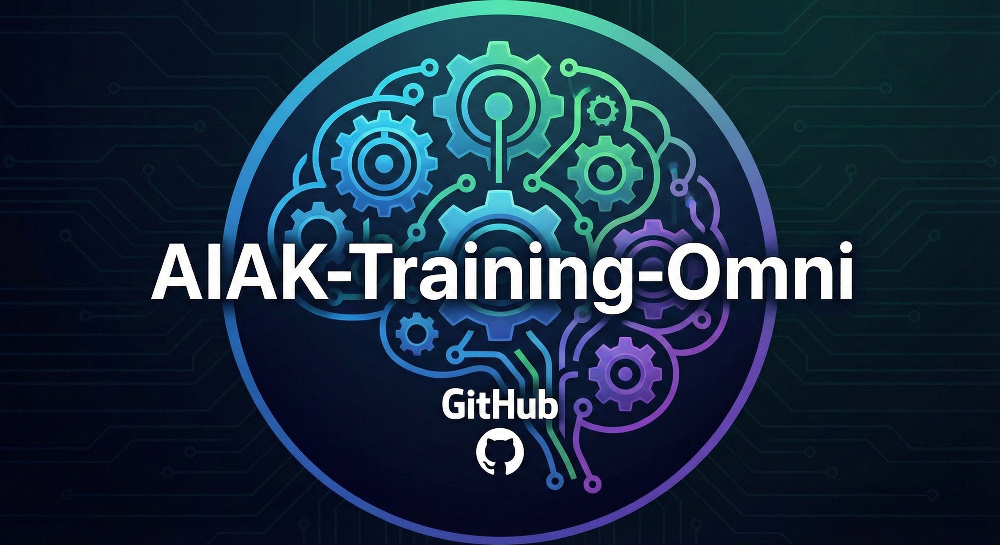

# AIAK-Training-Omni README

## Overview
The AIAK-Omni framework is a multimodal training framework based on Megatron, supporting large-scale training of various models and scenarios, with training performance reaching SOTA.

* Excellent performance, achieving SOTA training performance across multiple models, suitable for both large-scale training (&gt;1000 GPUs) and fine-tuning of small-scale models.
* Coverage of mainstream models and tasks, supporting over 10 types of LLM/VLM, and tasks including model pretraining and fine-tuning.
* Model combination, allowing flexible replacement of model components in VLM to achieve flexible networking.
* Rich tools provided, including efficient and scalable data components, weight conversion, etc.

## Latest News
[2026/01/31] 🔥We have released the AIAK-Training-Omni framework! A brand-new multimodal large model training framework.

## Features
* Flexible networking, we support flexible combination of different components in VLM, such as LLM/VIT, etc. See [model_combination.md](xxx.html) for details.
* Heterogeneous TP, supporting different TP size splitting for different components in VLM to cope with various model sizes, see [heterogeneous_tp_parallel.md](xxx.html) for details.
* DP data balance, optimizing the data parallel load imbalance problem introduced by data packing, see [data_parallel_balance.md](xxx.html) for details.
* Offline data packing, supporting offline data packing to reduce the number of padding tokens during training, see [offline_data_packing.md](xxx.html) for details.
* FP8 training, supporting FP8 precision training, see [fp8_training.md](xxx.html) for details.
* MOE optimization, the framework optimizes the training performance of MOE models, see [moe_all2all_overlap.md](xxx.html) for details.

## Benchmark
|**Model**|**Pai-Megatron-Patch**|**Veomni**|**Ours**|
|-|-|-|-|
|Qwen3-VL-30B|*4004（MFU:39.45%）*|3144 (MFU: 30.73%)|4241（**MFU:41.79%**）|

## Quick Start

### Quick Start for Qwen3
#### Installation

#### Prepare Data

#### Checkpoint conversion

#### Quick Start Qwen3-8b sft

### Quick Start for VLM Model Training
Refer to the [Quick Start for VLM Model Training](xxxx.html) document for details.

### Quick Start for LLM Model Training
Refer to the [Quick Start for LLM Model Training](xxxx.html) document for details.

### Quick Start for WAN Model Training
Refer to the [Quick Start for WAN Model Training](xxxx.html) document for details.

## Support Model
|**Model Type**|**Model Category**|**Model**|**Pretrain**|**SFT**|
|-|-|-|-|-|
|LLM|DeepSeek-V2|deepseek_v2_group|✅([example](examples/deepseek_v2/pretrain/pretrain_deepseek_v2_group.sh))|✅([example](examples/deepseek_v2/finetuning/sft_deepseek_v2_group.sh))|
|||deepseek_v2_lite_group|✅(example)|✅(example)|
||DeepSeek-V3|deepseek_v3_group_bf16|✅(example)|✅(example)|
|||deepseek_v3_group_fp8|✅(example)|✅(example)|
||Llama2|llama2_7b|✅(example)|✅(example)|
|||llama2_13b|✅(example)|✅(example)|
|||llama2_70b|✅(example)|✅(example)|
||Llama3|llama3_8b|✅(example)|✅(example)|
|||llama3_70b|✅(example)|✅(example)|
||Llama3.1|llama3.1_8b|✅(example)|✅(example)|
|||llama3.1_70b|✅(example)|✅(example)|
|||llama3.1_405b|✅(example)|✅(example)|
||Qwen|qwen_1.8b|✅(example)|✅(example)|
|||qwen_7b|✅(example)|✅(example)|
|||qwen_14b|✅(example)|✅(example)|
|||qwen_72b|✅(example)|✅(example)|
||Qwen1.5|qwen1.5_0.5b|✅(example)|✅(example)|
|||qwen1.5_1.8b|✅(example)|✅(example)|
|||qwen1.5_4b|✅(example)|✅(example)|
|||qwen1.5_7b|✅(example)|✅(example)|
|||qwen1.5_14b|✅(example)|✅(example)|
|||qwen1.5_32b|✅(example)|✅(example)|
|||qwen1.5_72b|✅(example)|✅(example)|
||Qwen2|qwen2_0.5b|✅(example)|✅(example)|
|||qwen2_1.5b|✅(example)|✅(example)|
|||qwen2_7b|✅(example)|✅(example)|
|||qwen2_72b|✅(example)|✅(example)|
||Qwen2.5|qwen2.5_0.5b|✅(example)|✅(example)|
|||qwen2.5_1.5b|✅(example)|✅(example)|
|||qwen2.5_3b|✅(example)|✅(example)|
|||qwen2.5_7b|✅(example)|✅(example)|
|||qwen2.5_14b|✅(example)|✅(example)|
|||qwen2.5_32b|✅(example)|✅(example)|
|||qwen2.5_72b|✅(example)|✅(example)|
||Qwen3|qwen3_0.6b|✅(example)|✅(example)|
|||qwen3_1.7b|✅(example)|✅(example)|
|||qwen3_4b|✅(example)|✅(example)|
|||qwen3_8b|✅(example)|✅(example)|
|||qwen3_14b|✅(example)|✅(example)|
|||qwen3_32b|✅(example)|✅(example)|
|||qwen3_30b_a3b|✅(example)|✅(example)|
|||qwen3_235b_a22b|✅(example)|✅(example)|
|||qwen3_480b_a35b|✅(example)|✅(example)|
|||qwen3_coder_30b_a3b|✅(example)|✅(example)|
|VLM|Qwen2.5-VL|qwen2.5_vl_3b|✅(example)|✅(example)|
|||qwen2.5_vl_7b|✅(example)|✅(example)|
|||qwen2.5_vl_32b|✅(example)|✅(example)|
|||qwen2.5_vl_72b|✅(example)|✅(example)|
||Qwen3-VL|qwen3_vl_30b_a3b|✅(example)|✅(example)|
|||qwen3_vl_235b_a22b|✅(example)|✅(example)|
||LLava-OV-1.5|llava_ov_4b||✅(example)|
|||llava_ov_30b_a3b||✅(example)|
||InternVL-2.5|internvl2.5_8b||✅(example)|
|||internvl2.5_26b||✅(example)|
|||internvl2.5_38b||✅(example)|
|||internvl2.5_78b||✅(example)|
||InternVL-3.5|internvl3.5_8b||✅(example)|
|||internvl3.5_14b||✅(example)|
|||internvl3.5_38b||✅(example)|
|||internvl3.5_30b_a3b||✅(example)|
|||internvl3.5_241b_a28b||✅(example)|
|Wan|Wan2.1|wan2.1_i2v_14b||✅(example)|
||Wan2.2|wan2.2_i2v_a14b||✅(example)|

## Citation
If you use this work, please consider citing:
```bibtex
@misc{AIAK-Training-Omni 2025,
      title={}, 
      author={},
      year={2025},
      eprint={2512.24077},
      archivePrefix={arXiv},
      primaryClass={cs.AI},
      url={}, 
}
```