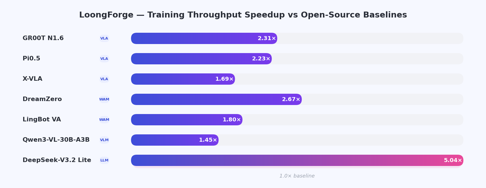

<p align="right"><sub><b>English</b> | <a href="./README_zh.md">简体中文</a></sub></p>

<div align="center">

<p align="center">
  <picture>
    <source media="(prefers-color-scheme: dark)"  srcset="./docs/assets/images/logo/banner-dark.svg">
    <source media="(prefers-color-scheme: light)" srcset="./docs/assets/images/logo/banner.svg">
    
  </picture>
</p>

<h4>A modular, scalable, high-performance training framework for LLMs, VLMs, diffusion, and embodied models.</h4>

<p align="center">

[![Home](https://img.shields.io/badge/LoongForge-Home-8A2CE3?logo=)](https://baidu-baige.github.io/LoongForge/)
[](https://loongforge.readthedocs.io/en/latest/index.html)
[](https://baidu-baige.github.io/LoongForge/blog/)
[](https://github.com/baidu-baige/LoongForge/releases)
[](https://github.com/baidu-baige/LoongForge/blob/master/LICENSE)
[](https://join.slack.com/t/baiduloongforge/shared_invite/zt-3ys3kaq2p-cmdw0nDoaHGOcKibgys5Yw)
[](https://github.com/baidu-baige/LoongForge/issues/80#issue-4594463290)

</p>

<p align="center">
  <b>🚀 Up to 5.04× training speedup</b> &nbsp;·&nbsp;
  <b>🌐 Native NVIDIA GPU & Kunlun XPU support</b>
</p>

<p align="center">
  <a href="#quickstart"><b>📖 Quick Start</b></a>
  &nbsp;·&nbsp;
  <a href="#benchmark"><b>📊 Benchmark</b></a>
  &nbsp;·&nbsp;
  <a href="#models"><b>🤖 Supported Models</b></a>
  &nbsp;·&nbsp;
  <a href="https://github.com/baidu-baige/LoongForge/issues/74"><b>🚀 Roadmap</b></a>
</p>

</div>

## 💡 Why LoongForge?

> 🐉 LoongForge is part of Baidu Baige's **Loong** open-source series — named after the traditional Chinese **loong boat (龙舟)**, a symbol of coordinated power and forward momentum.

**LoongForge** is a unified training framework for **LLMs, VLMs, diffusion, and embodied models**, covering **pre-training**, **continued pre-training**, and **SFT**. Its core LLM/VLM/diffusion stacks are built upon Megatron-LM with deep systemic enhancements across **model coverage**, **training performance**, and **hardware support**, while embodied models are trained on a dedicated torch-native stack — together delivering **significant speedups over mainstream open-source baselines**.

Before going open-source, LoongForge was developed as **AIAK-Training-LLM**, Baidu Baige's training acceleration stack. It has supported production training for enterprise customers across **Education**, **Computer Vision**, and **Embodied AI**, typically delivering **30%~50% speedup over customer baselines**, with the largest production runs reaching **5,000+ XPUs**.

## 🔥 Latest News

- **[2026/07]** ✨ Added training support for **DeepSeek v4 flash / DeepSeek v4 pro**.
- **[2026/05]** ⚡ Accelerated **Wan 2.2** training by **116%**, and added CP and data packing support.
- **[2026/05]** ✨ Added training support for **Kimi K2.5 / K2.6**, and introduced **INT4 / NVFP4** PTQ.
- **[2026/05]** 🎉 **v0.1.0** — first official tagged release of LoongForge.
- **[2026/05]** 🌟 Powered the training and public release of **LLaVA-OneVision-2.0**.
- **[2026/05]** 🤖 Expanded VLA coverage with **GR00T N1.6**; **60%+ speedup** on Pi0.5 and GR00T training. [[blog](https://baidu-baige.github.io/LoongForge/blog/2026-06-loongforge-groot-n16-acceleration.html)]
- **[2026/04]** 🧩 Added training support for **MiniMax-M2.7** on both NVIDIA GPU and Kunlun XPU.
- **[2026/04]** 🚀 LoongForge source code publicly available on GitHub. [[blog]](https://baidu-baige.github.io/LoongForge/blog/2026-04-announcing-loongforge.html)
- **[2025/10]** 🌟 Powered the training and public release of **LLaVA-OneVision-1.5** under **AIAK-Training-LLM**, the predecessor of LoongForge. [[blog]](https://baidu-baige.github.io/LoongForge/blog/2025-10-llava-onevision-case-study.html)

<a id="quickstart"></a>
## ⚡ Quick Start

See the full documentation for installation, tutorials, and advanced usage — [English](https://loongforge.readthedocs.io/en/latest/index.html) · [中文](https://loongforge.readthedocs.io/zh-cn/latest/index.html).

**1. Install** — using **prebuilt Docker images** or **source build**:
- **NVIDIA GPU**: [Installation Guide](https://loongforge.readthedocs.io/en/latest/get_started/installation.html)
- **Kunlun XPU**: [Installation Guide](https://loongforge.readthedocs.io/en/latest/kunlun_tutorial/install_p800.html)

**2. Launch your first training run** — follow a tutorial for your target hardware and modality:
- **NVIDIA GPU**: [LLM](https://loongforge.readthedocs.io/en/latest/llm_tutorial/quick_start_llm_pretrain.html) · [VLM](https://loongforge.readthedocs.io/en/latest/vlm_tutorial/quick_start_vlm_pretrain.html) · [VLA](https://loongforge.readthedocs.io/en/latest/vla_tutorial/quick_start_pi05_training.html) · [Diffusion (WAN)](https://loongforge.readthedocs.io/en/latest/wan_tutorial/quick_start_wan_training.html)
- **Kunlun XPU**: [Kunlun XPU Tutorials](https://loongforge.readthedocs.io/en/latest/kunlun_tutorial/README.html)

**3. Explore** — browse [`configs/models/`](./configs/models) and [`examples/`](./examples) / [`examples_xpu/`](./examples_xpu) for ready-to-run scripts.

## ✨ Key Features

* **🧩 Flexible Multi-Modal Composition** — Configuration-driven assembly of VLMs from interchangeable ViT and LLM components.
* **⚡ Heterogeneous Parallelism** — Independent TP / DP / recompute per model component (e.g., ViT vs. LLM) for optimal throughput and memory. [[blog](https://baidu-baige.github.io/LoongForge/blog/2026-05-loongforge-heterogeneous-parallel-training.html)]
* **🔀 Decoupled Encoder-Decoder Training** — Separates ViT and LLM into independent tasks, eliminating encoder-induced pipeline bubbles.
* **⚖️ DP Load Balancing** — Load-aware data redistribution mitigates sequence-packing imbalance, improving multi-node scaling efficiency. [[blog](https://baidu-baige.github.io/LoongForge/blog/2026-05-loongforge-dp-load-balancing.html)]
* **🚀 MoE-Native Optimization** — Overlapped All2All / activation offload / compute, with **further memory reduction** beyond upstream Megatron-LM on DeepSeek-V3, Qwen3-MoE, etc.
* **🚦 MoE Expert Load Balancing** — Dynamically replicates hot experts using a topology-aware algorithm to balance Expert Parallel (EP) workloads and improve training efficiency.
* **🔬 Adaptive FP8 Training** — End-to-end FP8 for LLMs and VLMs with standard **blockwise FP8**; optional **adaptive** mode picks per-operator precision by GEMM shape and efficiency.
* **🔧 Custom Fused Operators** — Fused kernels like **FusedDSA** for DSA-style models — TileLang version open-sourced, high-performance CUDA version available on Baidu Baige platform.
* **🔁 Flexible Checkpointing** — Offline bidirectional **Megatron ↔ HuggingFace** conversion plus native online HF load/save — no format barriers across your workflow.
* **🧰 Versatile Pipelines & Data Tools** — Out-of-the-box **Pretrain / MidTrain / SFT / LoRA**, with built-in dataset format conversion and sequence packing.
* **🌐 Heterogeneous Hardware** — Native support for **NVIDIA GPUs** and **Kunlun XPUs** via a minimally-intrusive plugin design.

> 📖 Deep-dive: [LLM features](https://loongforge.readthedocs.io/en/latest/llm_tutorial/features_index.html) · [VLM features](https://loongforge.readthedocs.io/en/latest/vlm_tutorial/features_index.html)

<a id="benchmark"></a>
## 📊 Benchmark

Measured on **v0.1.1** across LLM, VLM, VLA and DIT workloads against mainstream open-source training baselines:



<details>
<summary><b>📋 Detailed configurations & footnotes</b></summary>

<br>

| Model | Type | Baseline | Configuration | Speedup |
|---|---|---|---|---|
| Qwen3-30B-A3B | MoE | Megatron-LM<sup>†</sup> | 32 × A800<sup>‡</sup> · GBS 1024 · 32K | **1.16×** |
| DeepSeek-V3.2 Lite <sup>§</sup> | MoE + DSA | Megatron-LM<sup>†</sup> | Reduced-layer · GBS 128 · 8K | **5.04×** |
| Qwen3-VL-30B-A3B | VLM | VeOmni<sup>†</sup> | 32 × A800<sup>‡</sup> · GBS 128 · 32K | **1.45×** |
| GR00T N1.6 | VLA | LeRobot<sup>†</sup> | 8 × A800<sup>‡</sup> · GBS 128 · 224×224 | **2.31×** |
| Pi0.5 | VLA | OpenPI<sup>†</sup> | 8 × A800<sup>‡</sup> · GBS 112 · 224×224 | **1.65×** |

> <sup>§</sup> Due to test-bed scale limits, **DeepSeek-V3.2** was validated separately on a reduced-layer configuration — LoongForge's **DSA CUDA kernel optimizations** still deliver **~5× speedup** over Megatron-LM and reach **64K sequence** (baseline OOMs beyond 8K).<br>
> <sup>†</sup> Numbers reflect baseline and LoongForge versions at the time of measurement, and may evolve as implementations change.<br>
> <sup>‡</sup> Validation on additional hardware is rolling out in upcoming releases.<br>

</details>

## 🌟 Powered by LoongForge

Projects trained with LoongForge or its predecessor AIAK-Training-LLM:

- [LLaVA-OneVision-2.0](https://github.com/EvolvingLMMs-Lab/LLaVA-OneVision-2) — Next-generation multimodal model, with new VideoCaption and Spatial datasets.
- [Innovator-VL](https://github.com/InnovatorLM/Innovator-VL/tree/main) — Scientific Multimodal Large Language Model for Advanced Reasoning.
- [LLaVA-OneVision-1.5](https://github.com/EvolvingLMMs-Lab/LLaVA-OneVision-2/tree/1.5) — Fully open framework for democratized multimodal training.
- [Qianfan-VL](https://github.com/baidubce/Qianfan-VL) — Domain-Enhanced Vision-Language Models for Enterprise, 3B to 70B parameters.

<a id="models"></a>
## 🏛️ Supported Models

LoongForge supports a broad range of [state-of-the-art models](https://loongforge.readthedocs.io/en/latest/get_started/support_model.html) across LLM, VLM, diffusion, and embodied.

<table width="100%" style="table-layout: fixed; border-collapse: collapse;">
<colgroup>
<col width="25%">
<col width="25%">
<col width="25%">
<col width="25%">
</colgroup>
<thead align="center" valign="bottom">
<tr><th width="25%">LLM</th><th width="25%">VLM</th><th width="25%">Diffusion</th><th width="25%">Embodied</th></tr>
</thead>
<tbody valign="top">
<tr>
<td valign="top">
<ul>
<li><a href="examples/deepseek_v2/">DeepSeek-V2</a> ✅</li>
<li><a href="examples/deepseek_v3/">DeepSeek-V3/V3.2</a> ✅</li>
<li><a href="examples/deepseek_v4/">DeepSeek-V4</a> ✅</li>
<li><a href="examples/llama2/">LLaMA2</a> ✅</li>
<li><a href="examples/llama3/">LLaMA3</a> ✅</li>
<li><a href="examples/llama3.1/">LLaMA3.1</a> ✅</li>
<li><a href="examples/qwen/">Qwen</a> ✅</li>
<li><a href="examples/qwen1.5/">Qwen1.5</a> ✅</li>
<li><a href="examples/qwen2/">Qwen2</a> ✅</li>
<li><a href="examples/qwen2.5/">Qwen2.5</a> ✅</li>
<li><a href="examples/qwen3/">Qwen3</a> ✅</li>
<li><a href="examples/qwen3_next/">Qwen3-Next</a> ✅</li>
<li><a href="examples/minimax/">MiniMax-M2.1/2.5/2.7</a> ✅</li>
<li><a href="examples/mimo/">MIMO</a> ✅</li>
<li><a href="examples/glm5/">GLM-5</a> ✅</li>
<li><a href="examples/glm5.2/">GLM-5.2</a> ✅</li>
</ul>
</td>
<td valign="top">
<ul>
<li><a href="examples/qwen2.5_vl/">Qwen2.5-VL</a> ✅</li>
<li><a href="examples/qwen3_vl/">Qwen3-VL</a> ✅</li>
<li><a href="examples/qwen3.5/">Qwen3.5</a> ✅</li>
<li><a href="examples/qwen3.6/">Qwen3.6</a> ✅</li>
<li><a href="examples/kimi_k2.x/kimi_k2.5/">Kimi-K2.5/2.6</a> ✅</li>
<li><a href="examples/minicpm_v_4_6/">MiniCPM-V-4.6</a> ✅</li>
<li><a href="examples/glm5.2_vit/">GLM-5.2 + Kimi-K2.6 ViT</a> ✅</li>
<li><a href="examples/ernie4.5/">ERNIE4.5-VL</a> ✅</li>
<li><a href="examples/llava_onevision_1.5/">LLaVA-OneVision-1.5</a> ✅</li>
<li><a href="examples/internvl2.5/">InternVL2.5</a> ✅</li>
<li><a href="examples/internvl3.5/">InternVL3.5</a> ✅</li>
<li><a href="examples/custom/">CustomCombinedModel Example</a> ✅</li>
</ul>
</td>
<td valign="top">
<ul>
<li><a href="examples/wan/">Wan2.1</a> ✅</li>
<li><a href="examples/wan/">Wan2.2</a> ✅</li>
<li><a href="examples/qwen_image/">Qwen-Image</a> ✅</li>
</ul>
</td>
<td valign="top">
<ul>
<li><a href="examples/embodied/pi05/">Pi0.5</a> ✅</li>
<li><a href="examples/embodied/groot_n1_6/">GR00T-N1.6</a> ✅</li>
<li><a href="examples/embodied/groot_n1_7/">GR00T-N1.7</a> ✅</li>
<li><a href="examples/embodied/xvla/">xVLA</a> ✅</li>
<li><a href="examples/embodied/fastwam/">FastWAM</a> ✅</li>
<li><a href="examples/embodied/lingbot_va/">LingBot-VA</a> ✅</li>
<li><a href="examples/embodied/cosmos3/">Cosmos3</a> ✅</li>
<li><a href="examples/embodied/dreamzero/">DreamZero</a> ✅</li>
</ul>
</td>
</tr>
</tbody>
</table>

## 🏗️ Repository Layout

<details>
<summary><b>📁 Directory tree</b></summary>

```
LoongForge/
├── loongforge/                   # Core training framework
│   ├── train/                    # Training entry points & trainers
│   │   ├── pretrain/             #   Pretrain (LLM, VLM)
│   │   ├── sft/                  #   SFT (LLM, VLM, InternVL, ERNIE)
│   │   └── diffusion/            #   Diffusion (WAN)
│   ├── models/                   # Unified model abstractions
│   │   ├── foundation/           #   LLM backbones (LLaMA, Qwen, DeepSeek, ...)
│   │   ├── encoder/              #   Vision encoders (ViT, Qwen-VL, InternVL, ...)
│   │   ├── omni_models/          #   Multi-modal composition
│   │   ├── diffusion/            #   Diffusion models (WAN)
│   │   └── common/               #   Shared layers and utilities
│   ├── embodied/                 # LoongForge-Embodied: standalone torch-native (DDP/FSDP)
│   │                             #   embodied (VLA + world-action) subsystem — see loongforge/embodied/README.md
│   ├── data/                     # Data pipelines (multi-modal, video, DP balance)
│   ├── tokenizer/                # Tokenizers
│   └── utils/                    # Config map, constants, etc.
├── third_party/Loong-Megatron/   # Patched Megatron-LM (git submodule)
├── configs/                      # Hydra YAML configs (models, data)
├── examples/                     # GPU launch scripts
├── examples_xpu/                 # Kunlun XPU launch scripts
├── tools/                        # Checkpoint conversion, data preprocessing
├── ops/                          # Custom fused operators (incl. open-sourced TileLang)
├── patches/                      # TransformerEngine patches
├── docker/                       # Dockerfiles (GPU & XPU)
├── tests/                        # E2E test suite (YAML-driven)
└── docs/                         # Documentation
```

</details>

## 🤝 Contributing

We warmly welcome community contributions — bug reports, feature proposals, and PRs alike. Please read our [Contributing Guidelines](https://github.com/baidu-baige/LoongForge/blob/master/CONTRIBUTING.md) before submitting.

## 📄 License

LoongForge is released under the [Apache License 2.0](https://github.com/baidu-baige/LoongForge/blob/master/LICENSE). Some files are derived from third-party open-source projects; please refer to the specific file headers for their respective copyright and attribution.

## 📝 Citation

```bibtex
@software{LoongForge2026,
  title  = {LoongForge: A modular, scalable, high-performance training framework for LLMs, VLMs, diffusion, and embodied models},
  author = {{The LoongForge Authors}},
  year   = {2026},
  url    = {https://github.com/baidu-baige/LoongForge}
}
```

## 🙏 Acknowledgments

LoongForge is built upon NVIDIA's Megatron-LM. We also drew inspiration from several excellent open-source projects, including but not limited to HuggingFace Transformers, LLaMA-Factory, and Megatron-Bridge. We sincerely thank these communities for their outstanding contributions.

## 💬 Contact
<a id="contact"></a>

Open a GitHub issue for questions, feedback, or feature requests. You can also join our developer community:

- **WeChat** — [Scan QR code to join](https://github.com/baidu-baige/LoongForge/issues/80#issue-4594463290)
- **Slack** — [Join here](https://join.slack.com/t/baiduloongforge/shared_invite/zt-3ys3kaq2p-cmdw0nDoaHGOcKibgys5Yw)


