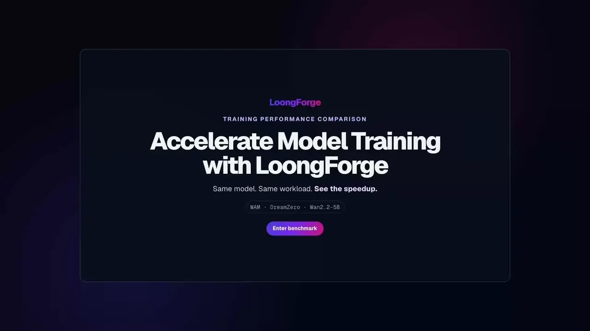
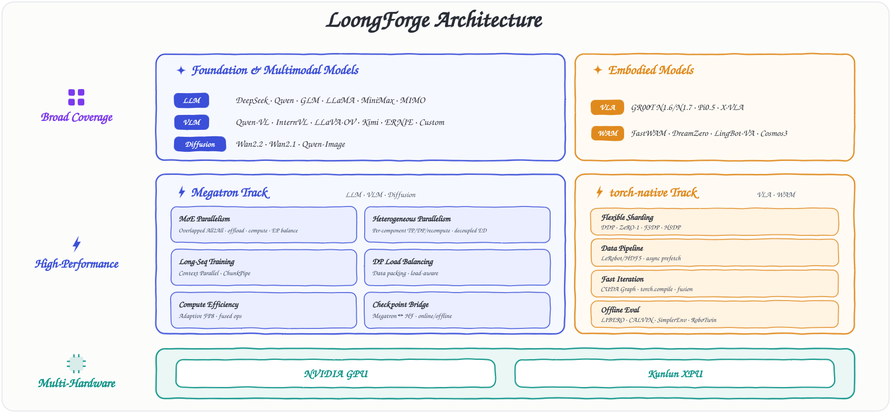
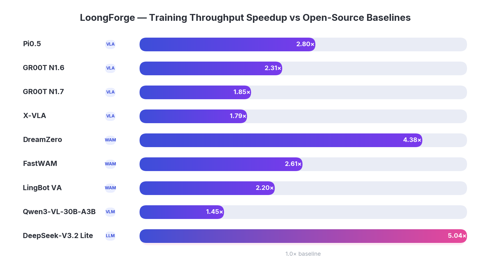

<p align="right"><sub><b>English</b> | <a href="./README_zh.md">简体中文</a></sub></p>

<div align="center">

<p align="center">
  <picture>
    <source media="(prefers-color-scheme: dark)"  srcset="./docs/assets/images/logo/banner-dark.svg">
    <source media="(prefers-color-scheme: light)" srcset="./docs/assets/images/logo/banner.svg">
    
  </picture>
</p>

<h3 align="center">Train LLMs, VLMs, diffusion, and embodied models — faster.</h3>

<p align="center">
  <a href="https://loongforge.readthedocs.io/en/latest/index.html"><b>Docs</b></a>
  &nbsp;·&nbsp;
  <a href="https://baidu-baige.github.io/LoongForge/blog/"><b>Blog</b></a>
  &nbsp;·&nbsp;
  <a href="#quickstart"><b>Quick Start</b></a>
  &nbsp;·&nbsp;
  <a href="#performance"><b>Performance</b></a>
  &nbsp;·&nbsp;
  <a href="#models"><b>Supported Models</b></a>
</p>

<p align="center">
  <a href="https://github.com/baidu-baige/LoongForge/stargazers"></a>
  <a href="./LICENSE"></a>
  <a href="https://hub.docker.com/u/loongforge"></a>
  <a href="./CONTRIBUTING.md"></a>
</p>

<p align="center">
  <a href="https://baidu-baige.github.io/LoongForge/"></a>
  <a href="https://discord.gg/RnY39D6CM"></a>
  <a href="https://github.com/baidu-baige/LoongForge/issues/80"></a>
  <a href="https://github.com/baidu-baige/LoongForge/issues/80"></a>
  <a href="https://x.com/baidu_baige_lf"></a>
</p>

<p align="center"><i>⭐ Star LoongForge to help more people discover it and grow the community.</i></p>

</div>

## 🐉 LoongForge

**LoongForge** is an open-source training framework developed by the [Baidu AI Cloud Baige team](https://cloud.baidu.com/product/aihc.html), built to deliver [faster training](#performance) for mainstream LLMs, VLMs, diffusion, and embodied models.

- **Easy to Use** — [Ready-to-run configs](./configs/models/) and [launch examples](./examples) for every supported model, spanning **pre-training**, **continued pre-training**, **SFT**, and **LoRA**.
- **High Performance** — Built on multiple backends (Megatron-LM and torch-native), with **deep optimizations** across parallelism strategy, memory footprint, communication overlap, and kernel efficiency — while keeping **training loss curves aligned with the baseline**.
- **Production-Proven** — Open-sourced from [AIAK-Training-LLM](https://cloud.baidu.com/doc/AIHC/s/Alyo476jr), a training suite that serves enterprise customers' proprietary models and powers [open-source model releases](#powered-by-loongforge), with production runs reaching **5,000+ XPUs**.

---

<h6 align="left">Performance comparison example: embodied-model DreamZero at 4.38× baseline throughput, loss curves aligned</h6>

<p align="center">
  <a href="https://baidu-baige.github.io/LoongForge/assets/video/dreamzero-comparison.mp4">
    <picture>
      <source media="(prefers-reduced-motion: reduce)" srcset="./docs/assets/images/demo/dreamzero-poster.jpg">
      
    </picture>
  </a>
</p>

## 🏗️ Architecture

Since optimal training strategies differ across model families and scales, LoongForge adopts a multi-backend architecture.

<p align="center">
  <picture>
    <source media="(prefers-color-scheme: dark)"  srcset="./docs/assets/images/architecture/loongforge-architecture-dark.svg">
    <source media="(prefers-color-scheme: light)" srcset="./docs/assets/images/architecture/loongforge-architecture.svg">
    
  </picture>
</p>

- **Megatron Stack** — For LLMs, VLMs, and diffusion models. Powered by a [patched Megatron-LM](https://github.com/baidu-baige/Loong-Megatron) and extended with MoE parallelism, per-component heterogeneous parallelism, long-sequence optimizations, etc.
- **Torch-Native Stack** — For embodied models (VLA and WAM). A standalone [torch-native subsystem](./loongforge/embodied) featuring **DDP / ZeRO-1 / FSDP / HSDP**, with deep optimizations for representative models across I/O, communication strategy, kernel efficiency, etc.

## 🔥 Latest News

- **[2026/09]** ✨ Added training support for **[GLM-5.3-flash](./examples/glm5_next/)**.
- **[2026/09]** ✨ Added **[Kimi-K3](./examples/kimi_k3/)** BF16 training support for both LLMs and VLMs.
- **[2026/09]** ⚡ Added an optimized **[DreamZero Wan2.2-5B FSDP recipe](./examples/embodied/dreamzero/run_dreamzero_wan22_5b_full_fsdp_finetune.sh)** with cache-aware data loading, compiled attention blocks, frozen-module handling, and FSDP2 Delta-FP8 Param AllGather.
- **[2026/08]** 🤖 Added VLA training support for **[Wall-OSS-0.5](./examples/embodied/wall_oss_0_5/)**, with custom fused operators for higher training throughput.
- **[2026/08]** 📄 Released the **[TAOT paper](https://arxiv.org/abs/2608.03676)** — topology-aware dynamic expert replica placement that tackles expert-parallel (**EP**) load imbalance in **MoE** training, cutting overhead by up to **74%** over industry solutions, with **1.43× speedup** measured on a real training case. [[blog](https://baidu-baige.github.io/LoongForge/blog/2026-08-taot-topology-aware-expert-placement.html)]
- **[2026/08]** ✨ Added training support for **GLM-5.2**, along with a **[GLM-5.2 + MoonViT](./configs/models/glm5.2_vit/)** custom-composition [example](./examples/glm5.2_vit/) for extending GLM with multimodal capabilities.
- **[2026/08]** ✨ Added training support for **MiniCPM-V-4.6** and **Qwen3.8-27B**.
- **[2026/08]** 🧪 Introduced a unified [**evaluation module**](./loongforge/embodied/eval/) for the embodied stack, currently covering **Pi0.5 / xVLA / GR00T**, with more models on the way.
- **[2026/07]** 🐳 Unified the **prebuilt Docker images** — all model families (LLM / VLM / VLA / Diffusion) now share a single image.
- **[2026/07]** 🤖 Released **[LoongForge-Embodied](./loongforge/embodied)**, a torch-native DDP/FSDP training subsystem for embodied models (Pi0.5, GR00T-N1.6/N1.7, xVLA, LingBot-VA, FastWAM, DreamZero, and Cosmos3), with up to **4.38× speedup**. [[blog](https://baidu-baige.github.io/LoongForge/blog/2026-07-announcing-loongforge-embodied.html)]
- **[2026/07]** ✨ Added training support for **DeepSeek-V4-Flash / DeepSeek-V4-Pro**.

<details>
<summary><b>📅 More</b></summary>

- **[2026/07]** ✨ Added training support for **Qwen-Image-Edit-2511**.
- **[2026/06]** 🤖 Expanded VLA coverage with **GR00T N1.6**; **2.3× speedup** on GR00T training. [[blog](https://baidu-baige.github.io/LoongForge/blog/2026-06-loongforge-groot-n16-acceleration.html)]
- **[2026/05]** ⚡ Accelerated **Wan 2.2** training by **116%**, and added CP and data packing support.
- **[2026/05]** ✨ Added training support for **Kimi K2.5 / K2.6**, and introduced **INT4 / NVFP4** PTQ.
- **[2026/05]** 🎉 **v0.1.0** — first official tagged release of LoongForge.
- **[2026/05]** 🌟 Powered the training and public release of **LLaVA-OneVision-2.0**.
- **[2026/04]** 🧩 Added training support for **MiniMax-M2.7** on both NVIDIA GPU and Kunlun XPU.
- **[2026/04]** 🚀 LoongForge source code publicly available on GitHub. [[blog](https://baidu-baige.github.io/LoongForge/blog/2026-04-announcing-loongforge.html)]
- **[2025/10]** 🌟 Powered the training and public release of **LLaVA-OneVision-1.5** under **AIAK-Training-LLM**, the predecessor of LoongForge. [[blog](https://baidu-baige.github.io/LoongForge/blog/2025-10-llava-onevision-case-study.html)]

</details>

## ✨ Key Features

**🚀 Foundation Models**

* **MoE EP Communication Optimization** — Overlapped All2All / activation offload / compute, with **further memory reduction** beyond upstream Megatron-LM. [[Usage](https://loongforge.readthedocs.io/en/latest/features/moe_all2all_overlap.html)]
* **MoE Expert Load Balancing** — Topology-aware dynamic replication of hot experts to balance EP workloads, with up to **74%** lower overhead than industry solutions. [[TAOT Paper](https://arxiv.org/pdf/2608.03676)]
* **Adaptive FP8 Training** — End-to-end FP8 for LLMs and VLMs with standard **blockwise FP8**; an optional **adaptive** mode picks per-operator precision by GEMM shape and efficiency. [[Usage](https://loongforge.readthedocs.io/en/latest/features/adaptive_fp8.html)]
* **Custom Fused Operators** — Fused kernels like **FusedDSA** for DSA-style models — TileLang version open-sourced, high-performance CUDA version available on Baidu Baige platform.
* **Long-Sequence Training** — Scales LLM training to long sequences via **Context Parallel (CP)** and **chunked-pipeline scheduling**.

**🧩 Multi-Modal Models**

* **Flexible Composition** — Assemble VLMs from interchangeable ViT and LLM components (e.g. **GLM-5.2 + MoonViT**) straight from config — no custom model code. [[Usage](https://loongforge.readthedocs.io/en/latest/features/model_combination.html)]
* **Heterogeneous Parallelism** — Independent TP / DP / recompute / freeze per model component (e.g. ViT vs. LLM) for optimal throughput and memory. [[blog](https://baidu-baige.github.io/LoongForge/blog/2026-05-loongforge-heterogeneous-parallel-training.html)] [[Usage](https://loongforge.readthedocs.io/en/latest/features/heterogeneous_parallel.html)]
* **Decoupled Encoder-Decoder Training** — Eliminates encoder-induced pipeline bubbles by separating ViT and LLM into independent tasks. [[Usage](https://loongforge.readthedocs.io/en/latest/features/heterogeneous_parallel.html#full-heterogeneous-dp-parallel)]
* **DP Load Balancing** — Improves multi-node scaling efficiency with load-aware data redistribution that mitigates sequence-packing imbalance. [[blog](https://baidu-baige.github.io/LoongForge/blog/2026-05-loongforge-dp-load-balancing.html)] [[Usage](https://loongforge.readthedocs.io/en/latest/features/data_parallel_balancing.html)]
* **Flexible Data Pipeline** — Energon **WebDataset** input for multimodal data, with both **online** and **offline** sequence packing. [[Usage](https://loongforge.readthedocs.io/en/latest/vlm_tutorial/dataset_conversion.html)]

**🤖 Embodied Models**

* **VLA & WAM Training** — A dedicated **torch-native DDP/FSDP** subsystem for **VLA and world-action (WAM)** models, decoupled from the Megatron core, with flexible **DDP / ZeRO-1 / FSDP / HSDP** strategies. [[README](./loongforge/embodied)]
* **Per-Model Deep Optimization** — **1.79×–4.38×** over official baselines in our [benchmarks](#performance), from training code customized per model across I/O, communication strategy, and kernel efficiency.
* **FP8 Communication Optimization** — Cuts cross-rank traffic on supported NVIDIA GPUs across both parallel strategies: blockwise FP8 delta AllGather for **FSDP2** parameters, and FP8 grad all-reduce for **DDP** gradients. [[Usage](https://loongforge.readthedocs.io/en/latest/features/fp8_communication.html)]
* **Unified Evaluation** — Evaluate trained policies on **LIBERO / CALVIN / SimplerEnv / RoboTwin**, with coverage expanding continuously. [[README](./loongforge/embodied/eval)]
* **Ego2Robot Data Conversion** — Turn first-person videos of human manipulation into **LeRobot v3.0** training data across **16 dual-arm robot morphologies**. [[README](./loongforge/embodied/tools/ego2robot)]

**🔌 Compatibility**

* **Mcore Bridge** — Supports both **offline** bidirectional **Megatron ↔ HuggingFace** conversion and **online** native HF load/save. [[Usage](https://loongforge.readthedocs.io/en/latest/features/mcore_bridge.html)]
* **Heterogeneous Hardware** — Native support for **NVIDIA GPUs** and **Kunlun XPUs** via a minimally-intrusive plugin design.

> 📖 Deep-dive: [LLM](https://loongforge.readthedocs.io/en/latest/llm_tutorial/features_index.html) · [VLM](https://loongforge.readthedocs.io/en/latest/vlm_tutorial/features_index.html) · [Embodied Model](https://loongforge.readthedocs.io/en/latest/embodied_tutorial/overview.html)

<a id="performance"></a>
## 📊 Performance

Training throughput speedups over mainstream open-source baselines — each model and its baseline were benchmarked on the same machine type with the same training hyperparameters:

<p align="center">
  
</p>

> DeepSeek-V3.2 Lite reflects DSA operator-level optimizations and was validated on a reduced-layer configuration due to test-bed scale limits.<br>
> Numbers were measured at a point in time and may evolve as implementations change on both sides.

<a id="quickstart"></a>
## ⚡ Quick Start

### 1. Install

Use the [latest prebuilt NVIDIA GPU image](https://hub.docker.com/u/loongforge) with NVIDIA Container Toolkit installed:

```bash
docker pull loongforge/loongforge:latest
mkdir -p workspace
docker run --gpus all --ipc=host -it --rm \
  -v "$(pwd)/workspace:/workspace/data" \
  -w /workspace/LoongForge \
  loongforge/loongforge:latest bash
```

[Source installation](https://loongforge.readthedocs.io/en/latest/get_started/installation.html) · [Kunlun XPU installation](https://loongforge.readthedocs.io/en/latest/kunlun_tutorial/install_p800.html).

### 2. Pick a tutorial — by hardware and modality

- **NVIDIA GPU**: [LLM](https://loongforge.readthedocs.io/en/latest/llm_tutorial/quick_start_llm_pretrain.html) · [VLM](https://loongforge.readthedocs.io/en/latest/vlm_tutorial/quick_start_vlm_pretrain.html) · [VLA & WAM](https://loongforge.readthedocs.io/en/latest/embodied_tutorial/quick_start_index.html) · [Diffusion](https://loongforge.readthedocs.io/en/latest/wan_tutorial/quick_start_wan_training.html)
- **Kunlun XPU**: [Kunlun XPU Tutorials](https://loongforge.readthedocs.io/en/latest/kunlun_tutorial/README.html)

### 3. Find your model's scripts

Launch scripts are available under [`examples/`](./examples/) (NVIDIA GPU) and [`examples_xpu/`](./examples_xpu/) (Kunlun XPU), with configs in [`configs/models/`](./configs/models/).

#### Example: DreamZero LoRA fine-tuning

This example uses **DreamZero Wan2.2-5B LoRA on a single node with 8 GPUs and FSDP**. Follow the [tutorial](https://loongforge.readthedocs.io/en/latest/embodied_tutorial/quick_start_dreamzero.html) to prepare weights (including Wan2.1 CLIP) and DROID data in LeRobot v2 format, then run inside the container:

```bash
cd /workspace/LoongForge
export WAN22_CKPT_DIR=/workspace/data/dreamzero/checkpoints/Wan2.2-TI2V-5B
export WAN21_CKPT_DIR=/workspace/data/dreamzero/checkpoints/Wan2.1-I2V-14B-480P
export TOKENIZER_PATH="$WAN22_CKPT_DIR/google/umt5-xxl"
export DATA_PATH=/workspace/data/dreamzero/data/droid_lerobot

EMBODIMENT_TAG=oxe_droid \
  bash examples/embodied/dreamzero/prepare_dreamzero_dataset.sh

GPUS_PER_NODE=8 TRAIN_ITERS=20 SAVE_INTERVAL=20 \
OUTPUT_DIR=/workspace/data/dreamzero/outputs/lora \
  bash examples/embodied/dreamzero/run_dreamzero_wan22_5b_lora_fsdp_finetune.sh
```

The example runs 20 steps and saves outputs under `OUTPUT_DIR`.

<a id="models"></a>
## 🏛️ Supported Models

Click any model for its training examples. See the [User Guide](https://loongforge.readthedocs.io/en/latest/index.html) for full instructions and the [model support matrix](https://loongforge.readthedocs.io/en/latest/get_started/support_model.html) for all variants.

<table width="100%">
<colgroup>
<col width="25%">
<col width="25%">
<col width="25%">
<col width="25%">
</colgroup>
<thead align="center" valign="bottom">
<tr><th width="25%">LLM</th><th width="25%">VLM</th><th width="25%">Diffusion</th><th width="25%">Embodied</th></tr>
</thead>
<tbody valign="top">
<tr>
<td valign="top">
<ul>
<li><a href="examples/deepseek_v2/">DeepSeek-V2</a> ✅</li>
<li><a href="examples/deepseek_v3/">DeepSeek-V3/V3.2</a> ✅</li>
<li><a href="examples/deepseek_v4/">DeepSeek-V4</a> ✅</li>
<li><a href="examples/llama2/">LLaMA2</a> ✅</li>
<li><a href="examples/llama3/">LLaMA3</a> ✅</li>
<li><a href="examples/llama3.1/">LLaMA3.1</a> ✅</li>
<li><a href="examples/qwen/">Qwen</a> ✅</li>
<li><a href="examples/qwen1.5/">Qwen1.5</a> ✅</li>
<li><a href="examples/qwen2/">Qwen2</a> ✅</li>
<li><a href="examples/qwen2.5/">Qwen2.5</a> ✅</li>
<li><a href="examples/qwen3/">Qwen3</a> ✅</li>
<li><a href="examples/qwen3_next/">Qwen3-Next</a> ✅</li>
<li><a href="examples/minimax/">MiniMax-M2.1/2.5/2.7</a> ✅</li>
<li><a href="examples/mimo/">MIMO</a> ✅</li>
<li><a href="examples/glm5/">GLM-5</a> ✅</li>
<li><a href="examples/glm5.2/">GLM-5.2</a> ✅</li>
<li><a href="examples/kimi_k3/">Kimi-K3</a> ✅</li>
</ul>
</td>
<td valign="top">
<ul>
<li><a href="examples/qwen2.5_vl/">Qwen2.5-VL</a> ✅</li>
<li><a href="examples/qwen3_vl/">Qwen3-VL</a> ✅</li>
<li><a href="examples/qwen3.5/">Qwen3.5</a> ✅</li>
<li><a href="examples/qwen3.6/">Qwen3.6</a> ✅</li>
<li><a href="examples/qwen3.8/">Qwen3.8</a> ✅</li>
<li><a href="examples/kimi_k2.x/kimi_k2.5/">Kimi-K2.5/2.6</a> ✅</li>
<li><a href="examples/kimi_k3/">Kimi-K3</a> ✅</li>
<li><a href="examples/minicpm_v_4_6/">MiniCPM-V-4.6</a> ✅</li>
<li><a href="examples/glm5.2_vit/">GLM-5.2 + MoonViT</a> ✅</li>
<li><a href="examples/glm5_next/">GLM-5.3-flash</a> ✅</li>
<li><a href="examples/ernie4.5/">ERNIE4.5-VL</a> ✅</li>
<li><a href="examples/llava_onevision_1.5/">LLaVA-OneVision-1.5</a> ✅</li>
<li><a href="examples/internvl2.5/">InternVL2.5</a> ✅</li>
<li><a href="examples/internvl3.5/">InternVL3.5</a> ✅</li>
<li><a href="examples/custom/">CustomCombinedModel Example</a> ✅</li>
</ul>
</td>
<td valign="top">
<ul>
<li><a href="examples/wan/">Wan2.1</a> ✅</li>
<li><a href="examples/wan/">Wan2.2</a> ✅</li>
<li><a href="examples/qwen_image/">Qwen-Image-Edit-2511</a> ✅</li>
</ul>
</td>
<td valign="top">
<ul>
<li><a href="examples/embodied/pi05/">Pi0.5</a> ✅</li>
<li><a href="examples/embodied/groot_n1_6/">GR00T-N1.6</a> ✅</li>
<li><a href="examples/embodied/groot_n1_7/">GR00T-N1.7</a> ✅</li>
<li><a href="examples/embodied/xvla/">xVLA</a> ✅</li>
<li><a href="examples/embodied/wall_oss_0_5/">Wall-OSS-0.5</a> ✅</li>
<li><a href="examples/embodied/fastwam/">FastWAM</a> ✅</li>
<li><a href="examples/embodied/lingbot_va/">LingBot-VA</a> ✅</li>
<li><a href="examples/embodied/cosmos3/">Cosmos3</a> ✅</li>
<li><a href="examples/embodied/dreamzero/">DreamZero</a> ✅</li>
</ul>
</td>
</tr>
</tbody>
</table>

<a id="powered-by-loongforge"></a>
## 🌟 Powered by LoongForge

Open-source models trained with **LoongForge** or its predecessor **AIAK-Training-LLM**:

| Model | Highlights |
|-------|-------------|
| [**LLaVA-OneVision-2.0**](https://github.com/EvolvingLMMs-Lab/LLaVA-OneVision-2) | Next-generation multimodal model, with new VideoCaption and Spatial datasets |
| [**Innovator-VL**](https://github.com/InnovatorLM/Innovator-VL/tree/main) | Scientific multimodal LLM for advanced reasoning |
| [**LLaVA-OneVision-1.5**](https://github.com/EvolvingLMMs-Lab/LLaVA-OneVision-2/tree/1.5) | Fully open framework for democratized multimodal training |
| [**Qianfan-VL**](https://github.com/baidubce/Qianfan-VL) | Domain-enhanced vision-language models for enterprise, 3B–70B parameters |

## 📂 Repository Layout

<details>
<summary><b>📁 Directory tree</b></summary>

```
LoongForge/
├── loongforge/                   # Core training framework
│   ├── train/                    # Training entry points & trainers
│   │   ├── pretrain/             #   Pretrain (LLM, VLM)
│   │   ├── sft/                  #   SFT (LLM, VLM, InternVL, ERNIE)
│   │   └── diffusion/            #   Diffusion (WAN, Qwen-Image)
│   ├── models/                   # Unified model abstractions
│   │   ├── foundation/           #   LLM backbones (LLaMA, Qwen, DeepSeek, ...)
│   │   ├── encoder/              #   Vision encoders (ViT, Qwen-VL, InternVL, ...)
│   │   ├── omni_models/          #   Multi-modal composition
│   │   ├── diffusion/            #   Diffusion models (WAN, Qwen-Image)
│   │   └── common/               #   Shared layers and utilities
│   ├── embodied/                 # LoongForge-Embodied: standalone torch-native (DDP/FSDP)
│   │                             #   embodied (VLA + world-action) subsystem — see loongforge/embodied/README.md
│   ├── data/                     # Data pipelines (multi-modal, video, DP balance)
│   ├── tokenizer/                # Tokenizers
│   └── utils/                    # Config map, constants, etc.
├── third_party/Loong-Megatron/   # Patched Megatron-LM (git submodule)
├── configs/                      # Hydra YAML configs (models, data)
├── examples/                     # GPU launch scripts
├── examples_xpu/                 # Kunlun XPU launch scripts
├── tools/                        # Checkpoint conversion, data preprocessing
├── ops/                          # Custom fused operators (incl. open-sourced TileLang)
├── patches/                      # TransformerEngine patches
├── docker/                       # Dockerfiles (GPU & XPU)
├── tests/                        # E2E test suite (YAML-driven)
└── docs/                         # Documentation
```

</details>

## 📝 Citation

If you find LoongForge helpful, please cite this project:

```bibtex
@software{LoongForge2026,
  title  = {LoongForge: A high-performance framework for training LLMs, VLMs, diffusion, and embodied models},
  author = {{The LoongForge Authors}},
  year   = {2026},
  url    = {https://github.com/baidu-baige/LoongForge}
}
```

If you use TAOT for MoE training in LoongForge, you can cite our paper:

```bibtex
@article{zhang2026taot,
  title   = {{TAOT}: Topology-Aware Optimal Transport for Dynamic Expert Replica Placement in {MoE} Training},
  author  = {Zhang, Lingyun and Zhang, Henghua and Gu, Shilei and Mo, Kai and Han, Shuai and Li, Shiyong and Wang, Yanpeng and Shen, Dou},
  journal = {arXiv preprint arXiv:2608.03676},
  year    = {2026},
  url     = {https://arxiv.org/abs/2608.03676}
}
```

## 🤝 Contributing

We warmly welcome community contributions — bug reports, feature proposals, and PRs alike. Please read our [Contributing Guidelines](./CONTRIBUTING.md) before submitting.

Thanks to all our contributors:

<a href="https://github.com/baidu-baige/LoongForge/graphs/contributors">
  
</a>

## 🙏 Acknowledgments

LoongForge stands on the shoulders of the open-source community. Its Megatron stack builds on NVIDIA's [Megatron-LM](https://github.com/NVIDIA/Megatron-LM), and the project also draws on [HuggingFace Transformers](https://github.com/huggingface/transformers), [LLaMA-Factory](https://github.com/hiyouga/LlamaFactory), [Megatron-Bridge](https://github.com/NVIDIA-NeMo/Megatron-Bridge), [LeRobot](https://github.com/huggingface/lerobot), and the official implementations of the models we support (e.g. [OpenPI](https://github.com/Physical-Intelligence/openpi), [NVIDIA Isaac GR00T](https://github.com/NVIDIA/Isaac-GR00T)). We also thank the [LINUX DO](https://linux.do/) community for its welcoming space for technical discussion and its support of open-source sharing.

<a id="contact"></a>
## 💬 Contact Us

| Channel | What it's for |
|---------|---------------|
| [**GitHub Issues**](https://github.com/baidu-baige/LoongForge/issues/new/choose) | Bug reports, usage questions, and feature requests |
| [**Developer Communities**](https://github.com/baidu-baige/LoongForge/issues/80) | WeChat group, Xiaohongshu, and more |
| [**Email**](mailto:loongforge@baidu.com) | Enterprise adoption, large-scale deployment, partnership, or any other topic |

## 📄 License

LoongForge is released under the [Apache License 2.0](./LICENSE); some files derive from third-party projects — see their file headers.
