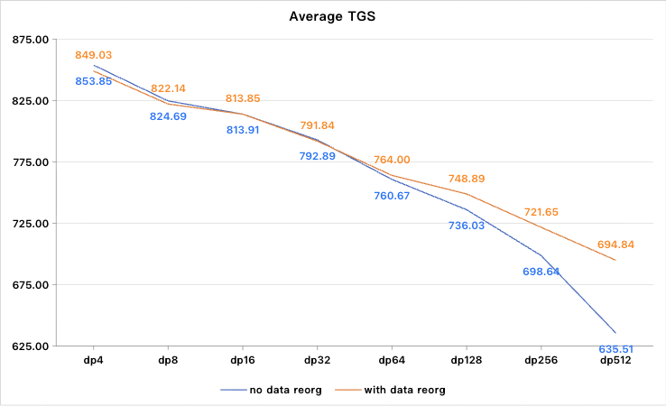

# DP Load-Balancing
`dp_parallel_balance` is a **low-intrusion, easy-to-adapt, and explainable** engineering solution that targets the DP-load-imbalance problem arising from **fixed-length packing + quadratic Attention complexity**.  
It significantly improves GPU utilisation and linear-scaling efficiency in **large-scale DP training**.

---

## 1. Background & Problem  
In large-model **Data-Parallel (DP)** training we usually apply **fixed-length packing**, concatenating several samples into a constant token length (e.g. 32 K / 64 K / 128 K):

∑<sub>i</sub> len(sample<sub>i</sub>) = L

This guarantees that every DP rank sees almost the same **O(n)** compute and memory footprint for embedding, MLP, linear layers, etc.

However, **Attention is O(n²)**. Its cost depends not only on the total length of a pack, but also on the **length distribution inside the pack**.

Taking `flash_attn_varlen` as an example:

* load(sample<sub>i</sub>) ∝ len(sample<sub>i</sub>)²  
* load(pack) ∝ ∑<sub>i</sub> len(sample<sub>i</sub>)²

Hence, even when two DP ranks own packs with identical total lengths, their Attention workloads can differ dramatically.

During training, the lightly-loaded ranks must wait for the heavily-loaded ones at the **All-Reduce** barrier, creating **stragglers** that lower GPU utilisation and degrade global throughput.  
The issue becomes pronounced when **DP size ≥ 32**.

---

## 2. Solution Overview  
The key idea is to **reorder samples across DP ranks** according to their **compute load** before the forward pass, so that every rank ends up with a similar workload.  
Expected benefits:

* Shorter gradient-sync waiting time  
* Mitigated straggler effect  
* Higher training throughput and better linear scaling  

`dp_parallel_balance` achieves this by **data reordering** only:

* Decoupled from model architecture  
* Preserves per-iteration randomness → **no convergence impact**  
* Main logic runs on **CPU** → **no extra GPU kernels**

---

## 3. Usage  
1. Add the flag in your training launcher:

```bash
--use-dp-balance
```

The feature has been **implemented and validated on InternVL** and is being extended to more models.

---

## 4. Core Design  

### Warm-up: Build a Load Model  
During the first few iterations we **profile** each DP rank’s sample-length distribution and iteration time, then fit the following per-rank model:

calc_load<sub>dp</sub> = x·∑<sub>i</sub> len(sample<sub>i</sub>)²  
        + y·∑<sub>i</sub> len(sample<sub>i</sub>)  
        + z·sample_num

* 1<sup>st</sup> term – quadratic Attention cost  
* 2<sup>nd</sup> term – linear layers / comms cost  
* 3<sup>rd</sup> term – fixed kernel-launch overhead  

Coefficients **x, y, z** are obtained automatically from warm-up data.

---

### Runtime: Load-Aware Reordering  
After every `get_batch`:

1. Gather global sample-length info  
2. Estimate per-sample load with the fitted model  
3. Sort samples by load  
4. **Redistribute high-load samples across DP ranks** to equalise total load  
5. Feed the reordered batch into training

---

## 5. Experimental Results  
Fixed **tensor-parallel = 4**, InternVL on *** dataset.  
Average tokens / GPU / sec (TGS) vs. DP size:



* **Small DP (4 / 8 / 16)**  
  – With or without reordering: almost identical TGS → imbalance is negligible.

* **Large DP (≥ 32)**  
  – Without reordering: TGS drops quickly because of stragglers.  
  – With `dp_parallel_balance`:  
    – Attention load balanced across ranks  
    – All-Reduce wait time reduced sharply  
    – Throughput degradation largely suppressed; benefit grows with DP scale