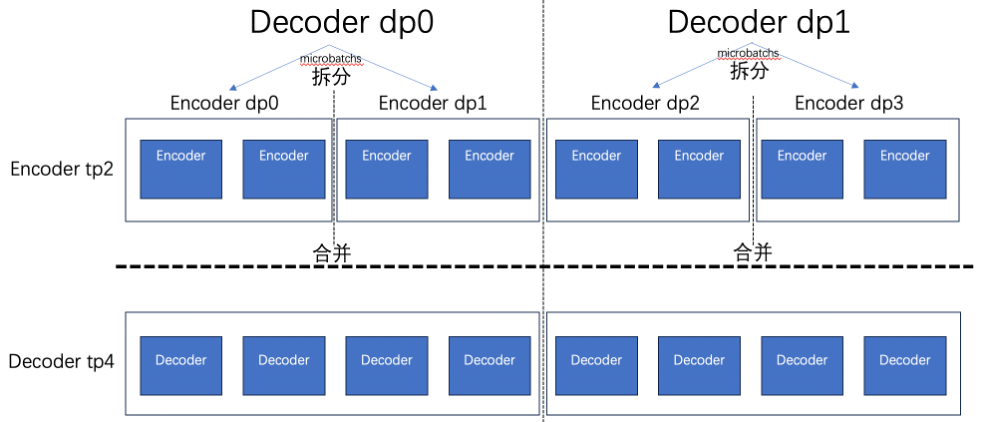
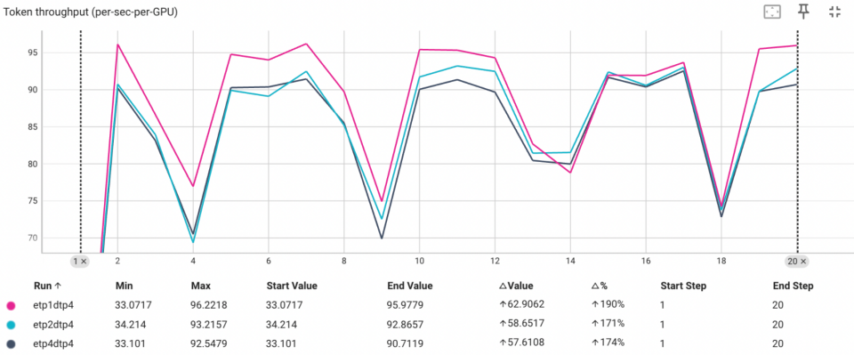
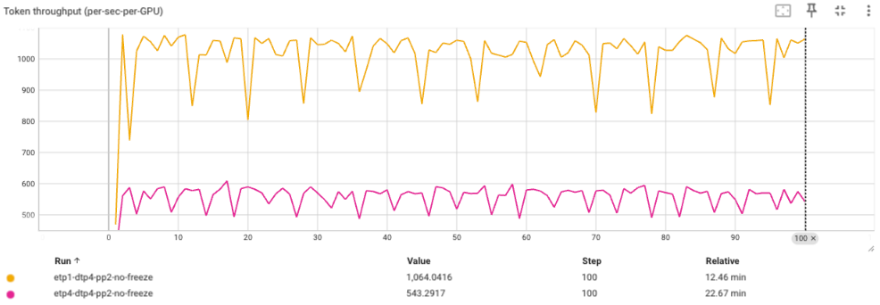

# Heterogeneous Parallel

## 1.Heterogeneous TP Parallel

LoongForge supports heterogeneous Tensor Parallel (TP) configuration for encoder and decoder, meaning encoder and decoder can use different TP sizes for parallel computation.

In this design, encoder and decoder are treated as two sub-modules with different computational characteristics and resource requirements. The system allows them to configure independent tensor parallel groups separately, enabling more fine-grained parallel strategy control within the same training or inference task.

This heterogeneous TP mechanism enables the model to flexibly select the most appropriate parallel granularity based on differences in computational intensity, parameter scale, activation size, and communication patterns between encoder and decoder, rather than being constrained by a unified TP configuration for the entire model.



### 1.1 Usage Method
Set `tensor-model-parallel-size` in the corresponding model's vit.yaml to specify the vit tp size. For example, adding `tensor_model_parallel_size: 2` in qwen3_vit specifies the vit's tp size:

```yaml
_target_: loongforge.models.encoder.Qwen3VisionModelConfig

num_layers: 27
hidden_size: 1152
kv_channels: 72
ffn_hidden_size: 4304
patch_size: 16
num_attention_heads: 16
num_query_groups: 16
image_size: [1344, 1344]
activation_func: ${act:gelu}
normalization: "LayerNorm"
add_bias_linear: true
add_qkv_bias: true
swiglu: False
group_query_attention: False
gated_linear_unit: False
position_embedding_type: "none"
bias_activation_fusion: False
deepstack_visual_indexes: [8, 16, 24]
num_position_embeddings: 2304

tensor_model_parallel_size: 2

model_type: "qwen3_vit"
```

Specify decoder tp size in the corresponding shell script:

```bash
MODEL_PARALLEL_ARGS=(
    --attention-backend flash
    --tensor-model-parallel-size 4
    --pipeline-model-parallel-size 2
    --expert-model-parallel-size 8
    --moe-token-dispatcher-type alltoall
    --use-distributed-optimizer
    # --sequence-parallel
    --overlap-grad-reduce
    --overlap-param-gather
    --distributed-backend nccl
)
```

### 1.2 Performance Results
Based on qwen2.5vl7b testing with decoder tp = 4 and encoder tp of 1, 2, and 4, different settings show different performance characteristics. Specific performance for different models requires testing.



For small-scale encoders like Vit (0.6b), a 5% performance improvement was achieved in the qwen2.5vl 7b model.

## 2.Heterogeneous DP Parallel

Heterogeneous tensor parallelism (TP) alone does not necessarily improve end-to-end performance. Therefore, LoongForge supports a heterogeneous data-parallel mechanism. The core idea is that after applying heterogeneous TP to the encoder and decoder, we can leverage multi-GPU parallelism by feeding different inputs to different encoder replicas, allowing them to compute simultaneously and thus reduce overall latency.

### 2.1 Usage Method
Add `--enable-encoder-hetero-dp` to the shell training script to enable heterogeneous data parallelism:
```bash
MODEL_PARALLEL_ARGS=(
    --attention-backend flash
    --pipeline-model-parallel-size 2
    --tensor-model-parallel-size 4
    --use-distributed-optimizer
    --overlap-grad-reduce
    --overlap-param-gather
    --distributed-backend nccl
    --enable-encoder-hetero-dp
)
```

Add `tensor_model_parallel_size: 1` to the corresponding model’s `vit.yaml`. Currently, when heterogeneous DP is enabled, only encoder TP size of 1 is supported.
```yaml
_target_: loongforge.models.encoder.Qwen2VisionRMSNormConfig

num_layers: 32
hidden_size: 1280
kv_channels: 80
ffn_hidden_size: 3420
patch_size: 14
num_attention_heads: 16
num_query_groups: 16
image_size: [1344, 1344]
activation_func: ${act:silu}
add_bias_linear: true
add_qkv_bias: true
swiglu: true
gated_linear_unit: true
position_embedding_type: "none"
bias_activation_fusion: False
hidden_dropout: 0
attention_dropout: 0
normalization: "RMSNorm"
apply_rope_fusion: true
tensor_model_parallel_size: 1
model_type: "qwen2_5_vit"
```

Note: Heterogeneous DP and heterogeneous TP are sensitive to the learning rate. A smaller learning rate, such as 1e-5, is recommended.

### 2.2 Performance Results
Based on qwen2.5vl7b testing with decoder tp = 4 and encoder tp = 1, enabling heterogeneous DP yields significant performance improvements.



## 3.Full Heterogeneous DP Parallel

Section 2 (Heterogeneous DP) allows the encoder to use the TP group as its data-parallel group, so that each GPU in the TP group independently processes different data through the encoder and then gathers the results. However, it is limited to the TP dimension only.

**Full Heterogeneous DP** extends this idea to the entire model-parallel group (TP × PP × CP). Every GPU in the model-parallel group independently processes a different microbatch through the encoder, and the results are gathered across the full model-parallel group before entering the decoder. This maximizes encoder throughput by leveraging all model-parallel GPUs for encoder data parallelism.

### 3.1 How It Works

In standard VLM training, each microbatch passes through:
1. **Encoder** (ViT): processes image/video tokens
2. **Decoder** (LLM): processes combined text + visual tokens

With Full Heterogeneous DP enabled:

1. **Encoder phase**: Each GPU in the model-parallel group (size = TP × PP × CP) independently processes a different microbatch through the encoder. Then a gather operation collects all encoder outputs to rank 0. This means the encoder effectively has a data-parallel degree of `TP × PP × CP`.

2. **Decoder phase**: The standard Megatron pipeline-parallel / tensor-parallel forward-backward runs as usual, using the pre-computed encoder embeddings.

3. **Backward phase**: After decoder backward, gradients are scattered back to each GPU in the model-parallel group, and encoder backward runs locally on each GPU.


### 3.2 Usage Method

#### Step 1: Set encoder TP size to 1 in vit.yaml

Full Heterogeneous DP requires `tensor_model_parallel_size: 1` for the encoder. Add or set this in the corresponding model's vit.yaml:

```yaml
_target_: loongforge.models.encoder.Qwen2VisionRMSNormConfig

num_layers: 32
hidden_size: 1280
kv_channels: 80
ffn_hidden_size: 3420
patch_size: 14
num_attention_heads: 16
num_query_groups: 16
image_size: [1344, 1344]
activation_func: ${act:silu}
add_bias_linear: true
add_qkv_bias: true
swiglu: true
gated_linear_unit: true
position_embedding_type: "none"
bias_activation_fusion: False
hidden_dropout: 0
attention_dropout: 0
normalization: "RMSNorm"
apply_rope_fusion: true
tensor_model_parallel_size: 1
recompute_granularity: full
recompute_method: uniform
recompute_num_layers: 1
model_type: "qwen2_5_vit"
```

#### Step 2: Add `--enable-full-hetero-dp` to the training script

```bash
MODEL_PARALLEL_ARGS=(
    --attention-backend flash
    --pipeline-model-parallel-size 2
    --tensor-model-parallel-size 4
    --use-distributed-optimizer
    --overlap-grad-reduce
    --overlap-param-gather
    --distributed-backend nccl
    --enable-full-hetero-dp
)
```

### 3.3 Constraints and Notes

1. **Encoder TP size must be 1**: Set `tensor_model_parallel_size: 1` in vit.yaml.
2. **micro-batch-size must be 1**: Packing mode with `micro-batch-size=1` is required for Full Heterogeneous DP.
3. **Learning rate sensitivity**: Heterogeneous DP configurations are sensitive to learning rate. A smaller learning rate (e.g., `1e-5`) is recommended.
4. **CP not available**: Full Heterogeneous DP currently does not support Context Parallelism (CP). `context-parallel-size` must be set to 1 when `--enable-full-hetero-dp` is enabled.
