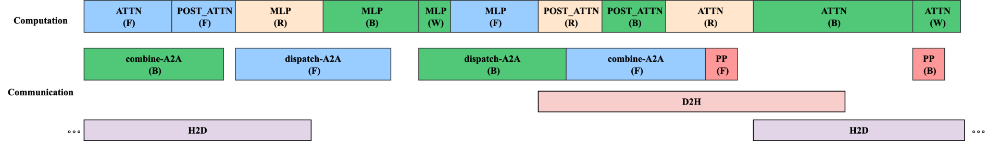

# MoE All-to-All Overlap  
LoongForge provides communication-oriented optimizations for MoE models. By adding the corresponding Megatron launch flags, the All-to-All traffic in Expert Parallel (EP) can be overlapped with computation, delivering the best training throughput.

---

## 1. 1F1B A2A Overlap

During MoE training the EP-induced All-to-All is usually one of the dominant bottlenecks. Inspired by DSv3 DualPipe, this framework interleaves the forward / backward computation of different micro-batches with EP All-to-All on the time axis. The expensive EP communication is thus hidden behind compute, greatly reducing its impact on overall throughput.

### Features
* Hide All-to-All with micro-batch overlap  
* Split weight-gradient and activation-gradient transfers for better PP overlap  
* FP8 training support  

### Usage
Add the following launcher flags:

```bash
--overlap-moe-expert-parallel-comm \
--delay-wgrad-compute
```

Prerequisite: Interleave 1F1B schedule must be enabled.

For best overlap we recommend:

```bash
export CUDA_DEVICE_MAX_CONNECTIONS=32
```
*(This may slightly hurt TP overlap; choose according to whether TP or EP dominates communication.)*

---

## 2. Fine-Grained Activation Offload

In long-context training the activation memory grows rapidly with sequence length and soon becomes the limiting factor. The common remedy is to combine Tensor Parallelism (TP) with **full-layer recomputation** to compress activation footprint.  
However, the 1F1B A2A overlap strategy relies on module-wise interleaving of adjacent batches, making traditional full-layer recomputation incompatible.

To solve this, the framework introduces **module-level selective recomputation plus fine-grained activation offload**, approximating the memory savings of full-layer recomputation while preserving the overlap schedule (see figure).


### Features
* Activation offload & reload hidden behind compute  
* Tensor-level offload granularity  
* FP8 training support  

### Usage
Enable **module-level selective recomputation**:

```bash
--recompute-granularity selective \
--recompute-modules a2a_overlap_attn a2a_overlap_post_attn a2a_overlap_mlp
```

Enable **tensor-level activation offload**:

```bash
--fine-grained-activation-offloading \
--offload-tensors dispatched_input pre_mlp_layernorm_output
```

Additionally, bind each process to the NUMA node local to its GPU to improve D2H/H2D bandwidth:

```bash
--bindpcie
```