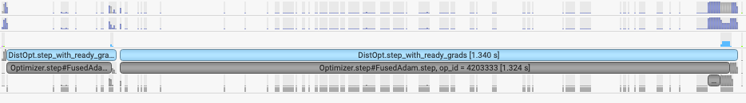
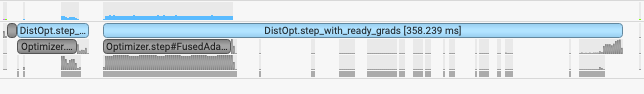

# Optimizer Support  
LoongForge offers optimizer off-loading and low-precision optimizers to cut memory usage when training in reduced precision.

---

## 1. Enable Optimizer Off-load for Low-Precision Training  
Optimizer off-load is one of the most effective ways to relieve GPU-memory pressure caused by optimizer states. By migrating part or all of these states to CPU RAM we can train larger models or use larger batch sizes without changing the compute graph.

**BF16 example**
```bash
--bf16 \
--use-precision-aware-optimizer \
--optimizer-cpu-offload \
--optimizer-offload-fraction 1.0
```

**FP8 example**
```bash
--fp8-format e4m3 \
--fp8-recipe blockwise \
# --fp8-param-gather \
--use-precision-aware-optimizer \
--optimizer-cpu-offload \
--optimizer-offload-fraction 1.0
```

Flag meanings  
* `--optimizer-cpu-offload` – turn on CPU off-load  
* `--optimizer-offload-fraction` – fraction of states to off-load (1.0 = all, 0.0 = none)  

Both flags require `--use-precision-aware-optimizer`.  
When enabled, training bit-exactness is preserved.

---

## 2. Low-Precision Optimizer States  
Instead of keeping the optimizer in FP32, we can store `exp_avg` and `exp_avg_sq` in BF16/FP16/FP8, cutting memory and bandwidth while maintaining numerical stability.

```bash
--use-precision-aware-optimizer \
--exp-avg-dtype bf16 \
--exp-avg-sq-dtype bf16
```

Flags  
* `--exp-avg-dtype` – data type of Adam’s first moment  
* `--exp-avg-sq-dtype` – data type of Adam’s second moment  

Again, `--use-precision-aware-optimizer` is mandatory.  
Training remains bit-exact.

---

## 3. Performance Tuning for Optimizer Off-load  
We replace Megatron’s native Torch CPU-Adam with DeepSpeed’s highly-optimized CPU-Adam (enabled by default).

To disable and fall back:
```bash
--no-use-deepspeed-cpu-adam
```

For best throughput export:
```bash
export OMP_NUM_THREADS=8
```

---

## 4. Performance Tuning for Low-Precision Optimizers  
We ship an optimized version of TransformerEngine’s low-precision optimizer (BF16 only).  
*Original TE step time ≈ 1.34 s*  

*Optimized step time ≈ 358 ms*


The faster path is enabled automatically when a low-precision optimizer is used.  
To force the original TE implementation:

```bash
export USE_BF16_BUFFER=false
```