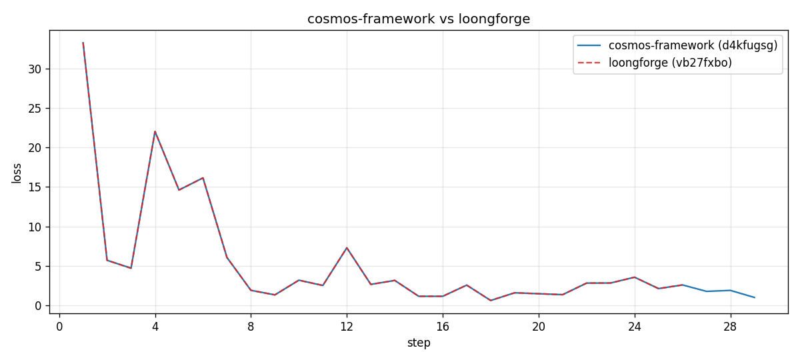

# 快速入门：Cosmos3-Nano模型训练

本文档介绍如何在 LoongForge 框架下快速启动 **Cosmos3-Nano** 的 SFT（监督微调）训练。示例: DROID Action-Policy SFT，采用 FSDP2 全分片、bf16 训练，与官方 cosmos-framework 的 `launch_sft_action_policy_droid` 对齐,对应的开源框架训练文档：[cosmos-framework action_policy_droid_posttrain.md](https://github.com/NVIDIA/cosmos-framework/blob/main/docs/action_policy_droid_posttrain.md)。

## 0. 资源准备

Cosmos3-Nano 是一个视觉-语言联合建模的动作策略模型，训练依赖三类外部资源：主干权重（Cosmos3-Nano + Wan2.2 VAE 编码器）、Qwen3-VL tokenizer / processor，以及 DROID 后训练数据集。下面分别说明。

### 0.1 模型权重

主权重来自 HuggingFace 上的 `nvidia/Cosmos3-Nano`。**Cosmos3 训练流程使用 DCP（Distributed Checkpoint）格式**，因此下载得到的原始 HF safetensors 权重需要先做一次离线转换，转换步骤参考官方框架文档 [training.md Step 2](https://github.com/NVIDIA/cosmos-framework/blob/main/docs/training.md#step-2--prepare-checkpoint)。转换后的 DCP 权重目录通过 `--pretrained-checkpoint` 加载：

```bash
--pretrained-checkpoint $CHECKPOINT_PATH   # 转换后的 DCP 权重目录
--init-on-meta                             # 权重延迟到 FSDP wrap 之后再加载，降低初始化峰值显存
```

除主权重外，视频分支还需要一个 VAE 编码器，Cosmos3-Nano 复用 Wan2.2-TI2V-5B 中的 `Wan2.2_VAE.pth`，路径由启动脚本的 `VAE_PATH` 指定：

- 主权重：[nvidia/Cosmos3-Nano](https://huggingface.co/nvidia/Cosmos3-Nano/tree/main)
- VAE：[Wan-AI/Wan2.2-TI2V-5B/Wan2.2_VAE.pth](https://huggingface.co/Wan-AI/Wan2.2-TI2V-5B/resolve/main/Wan2.2_VAE.pth?download=true)

### 0.2 Tokenizer

Cosmos3-Nano 的语言路径基于 Qwen3-VL-8B-Instruct，tokenizer / processor 直接复用其 HuggingFace 目录，通过 `--tokenizer-path` 加载：

```bash
hf download Qwen/Qwen3-VL-8B-Instruct --local-dir /workspace/ckpt/Qwen3-VL-8B-Instruct
export TOKENIZER_PATH=/workspace/ckpt/Qwen3-VL-8B-Instruct
```

### 0.3 数据集

示例使用 NVIDIA 官方发布的 DROID 后训练子集 [nvidia/Cosmos3-DROID](https://huggingface.co/datasets/nvidia/Cosmos3-DROID/tree/main/success)（`success/` 分支，LeRobot 格式），下载到本地：

```bash
hf download nvidia/Cosmos3-DROID --repo-type dataset --local-dir /workspace/data/Cosmos3-DROID
export DATASET_PATH=/workspace/data/Cosmos3-DROID/success
```

## 1. 数据配置

DROID 数据不需要额外的离线预处理，训练时通过内建的 `cosmos3_droid` 处理策略在线完成画面拼接、图像增强、动作对齐等步骤。启用方式是两个成对参数：

```bash
--dataset-format lerobot_datasets    # 数据集格式：LeRobot
--dataset-strategy cosmos3_droid     # Cosmos3 官方 DROID 数据处理策略
```

其余目标分辨率、动作 chunk 长度、CFG dropout 等已经写在 `configs/models/embodied/cosmos3/nano.yaml` 的 `data` 段（默认 `target_h/target_w=480`、`action_chunk_length=32`、`action_fps=15.0`），通常不需要覆盖。

## 2. 启动训练

启动脚本：`examples/embodied/cosmos3/run_cosmos3_nano_droid_fsdp_finetune.sh`。默认为单机 8 卡 FSDP2 + bf16，训练 500 步、每卡 batch=2。

### 2.1 环境变量

下面每个路径脚本里都有默认值，可单独覆盖：

```bash
cd /workspace/LoongForge

export LOONGFORGE_PATH=/workspace/LoongForge
export TOKENIZER_PATH=/workspace/ckpt/Qwen3-VL-8B-Instruct
export CHECKPOINT_PATH=/workspace/ckpt/Cosmos3-Nano-DCP   # 转换后的 DCP 权重目录
export VAE_PATH=/workspace/ckpt/Wan2.2_VAE/Wan2.2_VAE.pth # Wan2.2 VAE 编码器权重
export DATA_PATH=/workspace/data/Cosmos3-DROID/success
export OUTPUT_DIR=/workspace/outputs/cosmos3_nano_droid
```

### 2.2 启动脚本

单机 8 卡 FSDP2 SFT：

```bash
bash examples/embodied/cosmos3/run_cosmos3_nano_droid_fsdp_finetune.sh
```

### 2.3 关键参数说明

脚本内的参数按用途分组如下：

**模型与分布式：**

```bash
--model-name cosmos3_nano            # 通过 config_map 映射到 Cosmos3-Nano DROID 配方
--distributed-strategy fsdp          # 分布式策略：FSDP2 全分片
--dtype bfloat16                     # 训练精度：bf16
--fsdp-reduce-dtype bf16             # 梯度 reduce-scatter 用 bf16
--fsdp-wrap-modules MoTDecoderLayer  # 每个 MoT decoder layer 包一个 FSDP group
--init-on-meta                       # 通过 meta device 降低模型初始化时的峰值显存
```

**数据：**

```bash
--dataset-format lerobot_datasets    # 数据集格式：LeRobot
--dataset-strategy cosmos3_droid     # 官方 DROID 数据处理策略（画面拼接、图像增强等）
--dataset-path $DATA_PATH            # DROID 数据目录
--tokenizer-path $TOKENIZER_PATH     # Qwen3-VL tokenizer / processor 目录
--num-workers 4                      # DataLoader worker 数
```

**训练与优化器：**

```bash
--trainer-type FinetuneTrainer
--train-iters 500                    # 训练步数
--per-device-batch-size 2            # 每卡 batch
--gradient-accumulation-steps 1
--disable-tf32                       # 关闭 TF32，保持与官方参考实现一致的数值精度
--pretrained-checkpoint $CHECKPOINT_PATH
--save-interval 0                    # 0 表示不落 checkpoint，需要保存时传正整数
--seed 42
--set-seed-by-rank                   # 按 rank 偏移随机种子
```

**分组学习率与优化器：**

Cosmos3-Nano 的动作头（`action2llm` / `llm2action` / `action_modality_embed`）需要比视觉-语言主干更快的学习率，脚本用 `--lr-group` 按参数名前缀分组：

```bash
--lr-group net.action2llm=1e-3,net.llm2action=1e-3,net.action_modality_embed=1e-3,net=2e-4
                                     # 动作头 1e-3，其余 net 2e-4
--lr-decay-style lambda_linear       # 学习率衰减：线性
--lr-warmup-iters 0
--optimizer TorchFusedAdamW          # 优化器：fused AdamW
--clip-grad 1.0
--weight-decay 0.05
--adam-beta1 0.9
--adam-beta2 0.99
--adam-eps 1e-8
```

如需按实际训练规模调整，常用做法是：

- 覆盖 `--train-iters`、`--save-interval` 控制训练时长与 checkpoint 频率
- 覆盖 `--per-device-batch-size` 与 `--gradient-accumulation-steps` 调整 global batch
- 覆盖 `--lr-group` 中 `net=` 项微调主干学习率

### 2.4 性能开关

数据侧开关在启动脚本里配置，也可以在命令行追加同名参数：

```bash
# 增强 tail 放到模型 device 上执行，而不是在 dataloader worker 里
bash examples/embodied/cosmos3/run_cosmos3_nano_droid_fsdp_finetune.sh data.colorjitter_on_gpu=true
```

- `data.colorjitter_on_gpu`（默认 `false`）—— 打开后 worker 只做视频解码，ColorJitter 及其之后的处理都在 GPU 上执行。
- `--disable-tf32` —— 脚本默认带上以对齐参考实现，追求吞吐时去掉。
- `--per-device-batch-size` / `--num-workers` / `--gradient-accumulation-steps` —— 常规吞吐调节项。

### 2.5 正确性验证

在相同数据、权重和训练配置下，与官方 cosmos-framework 的 `launch_sft_action_policy_droid` 做了逐 step loss 对比：26 个 step 的 loss **逐位相同（max |Δ| = 0）**。



复现该对比时，下列参数需与官方保持一致：

```bash
--seed 42                            # 同 seed
--set-seed-by-rank                   # 按 rank 偏移种子，与官方 per-rank 行为一致
--dtype bfloat16                     # 训练精度 bf16
--fsdp-reduce-dtype bf16             # 梯度 reduce-scatter 精度
--fsdp-wrap-modules MoTDecoderLayer  # FSDP 分组粒度
--disable-tf32                       # 关闭 TF32
--deterministic-mode                 # 确定性 kernel，需同时导出 CUBLAS_WORKSPACE_CONFIG=:4096:8
```

此外，`GPUS_PER_NODE`、`--per-device-batch-size`、`--gradient-accumulation-steps` 决定 global batch 与采样分片，对齐实验中途不要改动。
