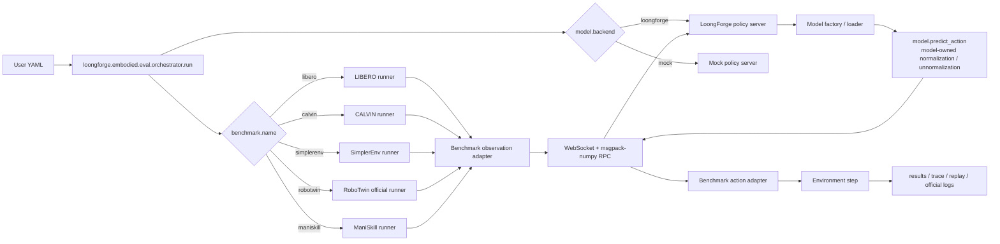

# LoongForge-VLA Offline Eval User Guide

This document explains how to run LoongForge-VLA offline evaluation under `/workspace/LoongForge-VLA/loongforge/embodied/eval` with a single YAML config. The module currently serves LoongForge **pi05** and **xvla** policy servers. LIBERO / SimplerEnv / RoboTwin already have verified task-success runs; the full matrix is in §2.1 and §11.

## 1. Module role

The eval stack decouples the benchmark client from the model server:

- Benchmark side: environment reset/step, observation/action adapters, result logging.
- Model side: independent policy server for action prediction.
- Communication: WebSocket + msgpack-numpy RPC.
- User entry: YAML only; CLI passes `--config`.
- Training-tree LoongForge source is not patched for eval. Model load/build compatibility lives in `eval/factories`; generic RPC and interface checks live in `eval/servers`.

### 1.1 End-to-end flow (LoongForge)



### 1.2 Data path

1. Start with `--config <yaml>`. `benchmark.name` selects the runner; `model.backend` selects the policy server backend.
2. The orchestrator starts the benchmark client and launches an independent LoongForge policy server via `server.python`.
3. The runner reads raw observations; the benchmark adapter converts them to the canonical observation schema (images, structured state, optional `model_state`, language, episode/task metadata).
4. The runner sends RPC over WebSocket + msgpack-numpy. Benchmark-native structured state stays on the adapter/trace side; the model server only receives `model_state`. The benchmark side does not import or modify LoongForge model code.
5. The LoongForge policy server picks a model factory from YAML. The factory imports the model, registers private config, loads a checkpoint (or random-init with `server.random_init: true`), and returns a model that implements `predict_action()`.
6. `GenericPredictActionPolicy` owns eval RPC, image-view packing, action-chunk cache, latency, metadata, shape checks, and action-dim truncation, then calls `model.predict_action(images, instructions, state=model_state, dataset_stats=dataset_stats)`.
7. Inside `predict_action()`, the model decides whether to consume `dataset_stats` and owns private state normalization / action unnormalization. Benchmark-native dict state is not cleaned up in the factory; adapters must emit a clean `model_state` when proprio is required.
8. The returned action chunk goes back to the client; the action adapter converts it to env actions (e.g. 7D for LIBERO/SimplerEnv/ManiSkill, 14D bimanual for RoboTwin).
9. After each step the runner logs episode results, traces, replays, or RoboTwin official artifacts. Policy server stdout/stderr go to `policy_server.log` (`server.log` in YAML).

## 2. What is supported

| Item | Status |
|---|---|
| LoongForge pi05 server | Supported; `PI05ModelFactory -> GenericPredictActionPolicy -> PI05Policy.predict_action()`; view count follows client (LIBERO 2 / RoboTwin 3) |
| LoongForge xvla server | Supported; `XVLAModelFactory -> GenericPredictActionPolicy`; `domain_id`, `action_postprocess`, `state_format: ee6d` per benchmark |
| Shared model API | `predict_action(images, instructions, state=None, dataset_stats=None)` validation + action shape normalize |
| LIBERO rollout | Supported; **pi05 / xvla real weights task-success verified** (§11) |
| CALVIN long-horizon | YAML + conda env + debug dataset; link smoke OK; **no formal CALVIN-domain pi05 / local X-VLA-Calvin score yet** |
| SimplerEnv rollout | Bridge WidowX; **xvla + X-VLA-WidowX task-success after patch**; pi05 still lacks Bridge finetune weights |
| RoboTwin official runner | Official evaluator; **pi05 (`pi05_aloha_14d`) and xvla (`ee6d_dual`) task-success** (§9 / §11) |
| ManiSkill runner | PickCube smoke; formal scores need ManiSkill-domain checkpoint + stats |
| RoboTwin `action_bridge` | `strict_14d` (default 14D joints), `duplicate_7d` (7D smoke only), `ee6d_dual` (X-VLA EE), `pi05_aloha_14d` (openpi Aloha: adapt_to_pi + delta→abs) |
| Action unnormalization | Inside model `predict_action()` (pi05 uses q99); eval only passes stats via `dataset_statistics_path` |
| Replay GIF / trace / summary | Supported; set `run.save_replay` / `run.save_trace` false under disk pressure |

### 2.1 Model × benchmark task-success (2026-07-21)

| | LIBERO | CALVIN | SimplerEnv (WidowX) | RoboTwin2 | ManiSkill |
|---|---|---|---|---|---|
| **pi05** | **success** (finetuned) | link smoke | no Bridge finetune weight | **success** (`pi0.5_robotwin2` + `pi05_aloha_14d`) | no matching weight |
| **xvla** | **success** (~94% object full) | needs official ABC_D weight | **success** (X-VLA-WidowX + patch) | **success** (X-VLA-RoboTwin2 + `ee6d_dual`) | no matching weight |

"Success" means at least one task episode passed the official/local success criterion, not RPC-only smoke.

### 2.2 Examples: public templates vs internal one-shot

User-editable YAML and launch scripts live under `examples/embodied/<model>/eval/`:

| Layer | Naming | Paths | Use |
|---|---|---|---|
| **Public** | `*.yaml` / `run_*_eval.sh` without `_internal` | always `/path/to/...` placeholders | External templates; replace paths/weights |
| **Internal** | `*_internal.yaml` / `run_*_eval_internal.sh` | real machine paths (`/workspace`, `/ssd1/...`) | Run as-is on internal hosts |

Do not put machine-specific absolute paths in non-`_internal` files.

```text
examples/embodied/
  pi05/eval/
    configs/<benchmark>/*.yaml              # public (libero/robotwin/calvin/simplerenv/maniskill)
    configs/<benchmark>/*_internal.yaml     # internal
    assets/pi05_robotwin2_dataset_stats.json
    run_*_eval.sh / run_*_eval_internal.sh
  xvla/eval/
    configs/<benchmark>/*.yaml              # same five benchmarks
    configs/<benchmark>/*_internal.yaml
    run_*_eval.sh / run_*_eval_internal.sh
    SIMPLERENV_PATCH_en.md
    xvla_libero_diagnosis.md
```

Each benchmark ships **one public + one internal** pair. Optional knobs go in file-header comments (no extra full-suite YAML files unless explicitly requested).

### 2.3 Task-success combos: open weights and configs

| Combo | Open weights | Public config | Internal one-shot |
|---|---|---|---|
| **pi05 + LIBERO** | pi0.5 LIBERO finetune (e.g. openpi `pi05_libero` family / local `model.safetensors` + `dataset_statistics.json`) | `examples/embodied/pi05/eval/configs/libero/object_smoke.yaml` | `run_libero_eval_internal.sh` → `object_smoke_internal.yaml` |
| **pi05 + RoboTwin** | pi0.5 RoboTwin-2.0 joint finetune (`model.safetensors` + openpi `norm_stats` → LoongForge stats, §9.2) | `.../pi05/eval/configs/robotwin/adjust_bottle_smoke.yaml` | `run_robotwin_eval_internal.sh` → `adjust_bottle_smoke_internal.yaml` |
| **xvla + LIBERO** | [2toINF/X-VLA-LIBERO](https://huggingface.co/2toINF/X-VLA-LIBERO) | `.../xvla/eval/configs/libero/libero_weight_object_smoke.yaml` (full suite: raise `max_tasks` / `episodes_per_task` in the same YAML; historical full artifacts under `reports/xvla/libero/libero_weight_object_full/`) | `run_libero_eval_internal.sh` → `libero_weight_object_smoke_internal.yaml` |
| **xvla + RoboTwin** | [2toINF/X-VLA-RoboTwin2](https://huggingface.co/2toINF/X-VLA-RoboTwin2) | `.../xvla/eval/configs/robotwin/adjust_bottle_smoke.yaml` | `run_robotwin_eval_internal.sh` → `adjust_bottle_smoke_internal.yaml` |
| **xvla + SimplerEnv** | [2toINF/X-VLA-WidowX](https://huggingface.co/2toINF/X-VLA-WidowX) | `.../xvla/eval/configs/simplerenv/widowx_stack_cube_smoke.yaml` | `run_simplerenv_eval_internal.sh` → `widowx_stack_cube_smoke_internal.yaml` |

Key protocol fields (task-success combos):

| Combo | Key config |
|---|---|
| pi05 + LIBERO | `action_dim: 7`, `action_horizon: 50`; matching `dataset_statistics.json` (q01/q99); no special `action_bridge` |
| pi05 + RoboTwin | `action_dim: 14`, `action_horizon: 32`; **`action_bridge: pi05_aloha_14d`**; `dataset_statistics_path` §9.2 |
| xvla + LIBERO | X-VLA-LIBERO weights; `domain_id: 3`; `action_postprocess: ee6d_to_axis_angle`; `server.state_format: ee6d`; `max_steps: 800` (object recommended) |
| xvla + RoboTwin | X-VLA-RoboTwin2; `domain_id: 6`; **`action_bridge: ee6d_dual`** |
| xvla + SimplerEnv | X-VLA-WidowX; `domain_id: 0`; `max_steps: 1200`; `control_mode: arm_pd_ee_target_base_pose_gripper_pd_joint_pos`; `action_postprocess: ee6d_to_simpler_abs_euler`; **must apply** `examples/embodied/xvla/eval/SIMPLERENV_PATCH_en.md` |

**Public usage:** download weights → replace `/path/to/...` in public YAML/scripts → run `run_*_eval.sh`. Overridable env vars: `REPO_ROOT`, `CONFIG`, `BENCHMARK_PYTHON`, `CUDA_VISIBLE_DEVICES`, `LD_LIBRARY_PATH`, `VK_ICD_FILENAMES`.

**Internal one-shot** (paths filled in):

```bash
bash examples/embodied/pi05/eval/run_libero_eval_internal.sh      # pi05 LIBERO
bash examples/embodied/pi05/eval/run_robotwin_eval_internal.sh    # pi05 RoboTwin
bash examples/embodied/xvla/eval/run_libero_eval_internal.sh      # xvla LIBERO
bash examples/embodied/xvla/eval/run_robotwin_eval_internal.sh    # xvla RoboTwin
bash examples/embodied/xvla/eval/run_simplerenv_eval_internal.sh  # xvla SimplerEnv
```

Internal task-success weight locations:

| Combo | Local checkpoint | Stats / notes |
|---|---|---|
| pi05 + LIBERO | `/ssd1/sunyuehang/pi05_libero_finetuned_v044` | same-dir `dataset_statistics.json`; tokenizer `/ssd1/huangyi/model/paligemma-3b-pt-224` |
| pi05 + RoboTwin | `/ssd1/sunyuehang/pi0.5_robotwin2` | `examples/embodied/pi05/eval/assets/pi05_robotwin2_dataset_stats.json` (§9.2) |
| xvla + LIBERO | `/ssd1/sunyuehang/xvla-libero` (HF X-VLA-LIBERO) | stats optional; `domain_id=3` |
| xvla + RoboTwin | `/ssd1/sunyuehang/X-VLA-RoboTwin2` | `domain_id=6`; `ee6d_dual` |
| xvla + SimplerEnv | `/ssd1/sunyuehang/X-VLA-WidowX` | `domain_id=0`; see `SIMPLERENV_PATCH_en.md` |

## 3. Environment requirements

Isolate by role:

- Benchmark env: simulator client, one conda env per benchmark, e.g. LIBERO `/workspace/miniconda3/envs/libero/bin/python`, CALVIN `.../calvin/...`, SimplerEnv `.../simplerenv/...`, RoboTwin `.../robotwin/...`, ManiSkill `.../maniskill/...`.
- Model server env: LoongForge pi05/xvla, e.g. `/workspace/miniconda3/envs/loongforge/bin/python`.

`lerobot==0.5.0` needs Python >= 3.12, so the LoongForge server must not use an old 3.10 env. Per-benchmark isolation and key dependency versions: `benchmark_envs.md`.

## 4. YAML structure

```yaml
benchmark:
  name: libero
  suite: libero_object  # optional: libero_spatial | libero_goal | libero_10
  max_tasks: 1
  episodes_per_task: 1
  max_steps: 300
  num_steps_wait: 10

model:
  backend: loongforge
  model_type: pi05
  name: loongforge-pi05
  action_dim: 7
  state_dim: 7
  action_horizon: 50
  max_action_dim: 32
  max_state_dim: 32
  compile_model: false

server:
  host: 127.0.0.1
  port: 12093
  health_port: 12094
  python: /workspace/miniconda3/envs/loongforge/bin/python
  log: /path/to/policy_server.log
  start_timeout_sec: 900
  ckpt_path: /path/to/checkpoint_or_model_dir
  dataset_statistics_path: /path/to/dataset_statistics.json
  tokenizer_path: /path/to/paligemma-3b-pt-224
  use_bf16: false
  loongforge_root: /workspace/LoongForge-VLA

run:
  output_dir: /workspace/LoongForge-VLA/loongforge/embodied/eval/reports/pi05/libero/object_smoke
  seed: 7
  save_trace: true
  save_replay: true

timeouts:
  policy_call_ms: 600000
  per_step_sec: 600
  per_episode_sec: 900
```

Key fields:

- `benchmark.name` selects the runner: `libero`, `calvin`, `simplerenv`, `robotwin`, `maniskill`.
- `model.backend`: `loongforge` or `mock`.
- `model:` only model-structure fields (`action_dim`, `action_horizon`, `compile_model`, …) matching each ModelConfig dataclass.
- `server.ckpt_path`: directory containing `model.safetensors`, or the weight file itself.
- `server.dataset_statistics_path`: passed through for pi05 action unnormalization inside `predict_action()`.
- `server.python`: LoongForge server interpreter.
- `run.output_dir`: stable run-tag directory; unified entry defaults to timestamped subdirs so old `results.jsonl` is not reused.
- Under disk pressure or interface-only smoke: `run.save_replay: false`, `run.save_trace: false` keeps only `results.jsonl`, `summary.csv`, `suite_summary.csv`, and `policy_server.log`.

## 5. Running LIBERO

```bash
cd /workspace/LoongForge-VLA
examples/embodied/pi05/eval/run_libero_eval.sh
```

pi05 LIBERO ships **one task-success pair** only:

- Public: `examples/embodied/pi05/eval/configs/libero/object_smoke.yaml`
- Internal: `examples/embodied/pi05/eval/configs/libero/object_smoke_internal.yaml`

Default `suite: libero_object`. Change suite / episode counts inside the YAML (header comments list options).

```bash
cd /workspace/LoongForge-VLA
# public (edit /path/to/... first)
examples/embodied/pi05/eval/run_libero_eval.sh
# internal one-shot
examples/embodied/pi05/eval/run_libero_eval_internal.sh
```

## 6. Running CALVIN

CALVIN is long-horizon Franka language manipulation (5 subtasks per sequence). Metrics: `success_count`, Avg. Length, Task 1–5 success rates. `benchmark.dataset_path` must point at a tree that contains `validation/`.

pi05 has **no CALVIN-domain weight**; examples keep **one link-smoke pair** with **`server.random_init: true`**:

- Public: `examples/embodied/pi05/eval/configs/calvin/smoke.yaml`
- Internal: `.../smoke_internal.yaml`

```bash
cd /workspace/LoongForge-VLA
examples/embodied/pi05/eval/run_calvin_eval.sh           # public
examples/embodied/pi05/eval/run_calvin_eval_internal.sh  # internal
```

Edit suite / sequence count / step budget in YAML. With a CALVIN-domain checkpoint: set `random_init: false` and fill `ckpt_path` / `dataset_statistics_path`. xvla also has calvin smoke configs under `examples/embodied/xvla/eval/configs/calvin/` (formal scores need official ABC_D weights, `domain_id=2`, `action_postprocess: ee6d_to_calvin_abs`).

## 7. Running SimplerEnv

### 7.1 pi05 × SimplerEnv (link smoke only, `random_init`)

pi05 has no Bridge/WidowX finetune weight; examples keep **one pair** with **`server.random_init: true`** (no fake weights, no task-success claim):

- Public: `examples/embodied/pi05/eval/configs/simplerenv/widowx_stack_cube_smoke.yaml`
- Internal: `.../widowx_stack_cube_smoke_internal.yaml`

```bash
cd /workspace/LoongForge-VLA
examples/embodied/pi05/eval/run_simplerenv_eval.sh
examples/embodied/pi05/eval/run_simplerenv_eval_internal.sh
```

Switch Bridge tasks (eggplant / carrot / spoon, …) via `task_name` / `robot_setup` / `scene_name` in the same YAML. The runner re-execs before importing SAPIEN so `LD_LIBRARY_PATH` and `VK_ICD_FILENAMES` take effect.

### 7.2 X-VLA × SimplerEnv (task-success)

Use WidowX-domain weights (e.g. `/ssd1/sunyuehang/X-VLA-WidowX`), aligned with official `evaluation/simpler/WidowX`:

```yaml
benchmark:
  name: simplerenv
  domain_id: 0
  max_steps: 1200
  control_mode: arm_pd_ee_target_base_pose_gripper_pd_joint_pos
  action_postprocess: ee6d_to_simpler_abs_euler
```

Upstream SimplerEnv does **not** ship absolute EE control by default; follow `examples/embodied/xvla/eval/SIMPLERENV_PATCH_en.md` (255isWhite fork or two local patches). Configs: `examples/embodied/xvla/eval/configs/simplerenv/`.

### SAPIEN / Vulkan troubleshooting

SimplerEnv, RoboTwin, and ManiSkill depend on SAPIEN rendering. Before adapting a new SAPIEN benchmark, verify the Vulkan ICD — not only `nvidia-smi`. If `vulkaninfo` shows only `llvmpipe` / `lavapipe`, visual obs / camera / replay may segfault; a state-only rollout passing does **not** prove the visual path works.

Internal quick check:

```bash
LD_LIBRARY_PATH=/ssd1/opt/nvidia_lib:/usr/lib64:${LD_LIBRARY_PATH:-} \
VK_ICD_FILENAMES=/ssd1/opt/nvidia_lib/10_nvidia.json \
vulkaninfo
```

Expect `deviceName = NVIDIA ...` and `driverName = NVIDIA`. Set `LD_LIBRARY_PATH`, `VK_ICD_FILENAMES`, `XDG_RUNTIME_DIR` **before** importing SAPIEN / svulkan2 / ManiSkill / the renderer; re-exec the Python process if needed. Changing `LD_LIBRARY_PATH` after Python starts is usually insufficient.

## 8. Running ManiSkill

ManiSkill is a SAPIEN-based, GPU-friendly manipulation suite. Shipped examples keep **one link-smoke pair** with **`server.random_init: true`** (no formal task-success claim for open weights):

- Public: `examples/embodied/pi05/eval/configs/maniskill/pick_cube_smoke.yaml`
- Internal: `.../pick_cube_smoke_internal.yaml`

Default `PickCube-v1`, `pd_ee_delta_pose`, 7D action. Task / `obs_mode` (rgbd vs state) in YAML comments.

**Proprio / `model_state`:** the ManiSkill adapter maps Panda `qpos` to a numeric vector for the model. When `qpos` is 9D (7 arm + 2 finger), it emits **8D** = 7 joints + mean of the two finger joints (RLinf/openpi ManiSkill-style). Joint list in structured `state` remains full `qpos`. Single-camera `base_camera` only (no wrist packing in the adapter).

```bash
cd /workspace/LoongForge-VLA
examples/embodied/pi05/eval/run_maniskill_eval.sh
examples/embodied/pi05/eval/run_maniskill_eval_internal.sh
```

With a ManiSkill-domain checkpoint: set `random_init: false` and fill `ckpt_path` / `dataset_statistics_path` (state dim must match training, typically 8 for openpi/RLinf ManiSkill stats). xvla has matching smoke configs under `examples/embodied/xvla/eval/configs/maniskill/`.

> **Not the same as RLinf PutOnPlate:** RLinf’s pi0.5 ManiSkill SFT (`RLinf-Pi05-ManiSkill-25Main-SFT`) is trained on **`PutOnPlateInScene25Main-v3`** (WidowX Bridge real2sim), not stock `PickCube-v1` + Panda. LoongForge does not ship that RLinf env; PickCube smoke only proves the ManiSkill runner/RPC path.

## 9. Running RoboTwin

RoboTwin is launched via official `script/eval_policy.py`; the bridge is `loongforge/embodied/eval/bridges/robotwin_policy.py`. Pick `benchmark.action_bridge` (or `model.robotwin_action_bridge`) per model.

### 9.1 `action_bridge` map

| bridge | Role | Action / control | Notes |
|---|---|---|---|
| `strict_14d` | default 14D joints | joint qpos via `take_action` | model output ≥14D; no Aloha adapt_to_pi |
| `duplicate_7d` | smoke only | 7D duplicated to 14D | **not** for formal scores |
| `pi05_aloha_14d` | **pi0.5 RoboTwin formal protocol** | joint qpos | openpi Aloha: `adapt_to_pi` decode state → model → delta→abs → `adapt_to_pi` encode; reorder off |
| `ee6d_dual` | **X-VLA RoboTwin formal protocol** | `take_action(..., action_type='ee')` | 20D ee6d, three views, proprio closed-loop fill; instruction = task name with spaces |

> **Note:** Set `action_bridge` only in YAML (`benchmark.action_bridge` or `model.robotwin_action_bridge`). The runner CLI does not expose `--action-bridge`; values come from the config file.

### 9.2 pi05 + RoboTwin (task-success)

Weight example: `/ssd1/sunyuehang/pi0.5_robotwin2` (PyTorch `model.safetensors` + openpi `assets/.../norm_stats.json` in the checkpoint). Training side: `adapt_to_pi=True`, `use_delta_joint_actions=True`, `action_horizon=32`, three views head/left/right.

```bash
cd /workspace/LoongForge-VLA
CONFIG=examples/embodied/pi05/eval/configs/robotwin/adjust_bottle_smoke_internal.yaml \
  examples/embodied/pi05/eval/run_robotwin_eval_internal.sh
```

Key YAML fields:

```yaml
benchmark:
  name: robotwin
  task_name: adjust_bottle
  task_config: demo_clean
  action_bridge: pi05_aloha_14d
  max_steps: 300
model:
  model_type: pi05
  action_dim: 14
  state_dim: 14
  action_horizon: 32
server:
  ckpt_path: /path/to/pi0.5_robotwin2
  dataset_statistics_path: examples/embodied/pi05/eval/assets/pi05_robotwin2_dataset_stats.json
```

#### Where `pi05_robotwin2_dataset_stats.json` comes from

It is **not** re-computed at train time; it is the openpi `norm_stats.json` from the **pi0.5 RoboTwin-2.0 weight package**, with keys renamed for LoongForge pi05 `predict_action` q99 normalize/unnormalize.

| Item | Detail |
|---|---|
| Source checkpoint | internal: `/ssd1/sunyuehang/pi0.5_robotwin2` |
| Source file | `assets/pi0.5_clean_randomize_joint_training/norm_stats.json` (openpi training asset, ships with weights) |
| openpi shape | `{"norm_stats": {"state": {mean,std,q01,q99}, "actions": {...}}}` |
| LoongForge shape | `{"observation.state": {mean,std,q01,q99}, "action": {...}}` (keys aligned with LeRobot / pi05 `dataset_stats`) |
| Values | field-identical to source (only keys: `state`→`observation.state`, `actions`→`action`) |
| In-repo path | `examples/embodied/pi05/eval/assets/pi05_robotwin2_dataset_stats.json` |

Generate from any openpi-style checkpoint:

```python
import json
from pathlib import Path

src = Path("/path/to/pi0.5_robotwin2/assets/pi0.5_clean_randomize_joint_training/norm_stats.json")
raw = json.loads(src.read_text())["norm_stats"]
out = {
    "observation.state": raw["state"],
    "action": raw["actions"],
}
Path("pi05_robotwin2_dataset_stats.json").write_text(json.dumps(out, indent=2))
```

On the joint path the adapter sets `model_state = joint` (14D); `pi05_aloha_14d` applies adapt_to_pi inside the bridge and does **not** affect `ee6d_dual`.

### 9.3 X-VLA + RoboTwin (task-success)

Aligned with official `evaluation/robotwin-2.0`: `domain_id: 6`, `action_bridge: ee6d_dual`, weights e.g. `/ssd1/sunyuehang/X-VLA-RoboTwin2`.

```bash
cd /workspace/LoongForge-VLA
CONFIG=examples/embodied/xvla/eval/configs/robotwin/adjust_bottle_smoke_internal.yaml \
  examples/embodied/xvla/eval/run_robotwin_eval_internal.sh
```

### 9.4 Link smoke (no formal weight)

pi05 RoboTwin examples keep only `adjust_bottle_smoke(_internal).yaml`. Without formal weights, temporarily edit the same YAML:

- `server.random_init: true`, `max_steps: 5`: random 14D, official runner connectivity
- `action_bridge: duplicate_7d` (and model `action_dim: 7`): interface smoke only — **not** a score
- `action_bridge: strict_14d`: raw 14D joints, no adapt_to_pi (not the openpi formal protocol)

## 10. Outputs

LIBERO / CALVIN / SimplerEnv / ManiSkill write under `run.output_dir`:

| File | Meaning |
|---|---|
| `results.jsonl` | per-episode results |
| `summary.csv` | task-level aggregate |
| `suite_summary.csv` | suite-level aggregate |
| `artifacts/.../replay_*.gif` | replay GIF |
| `artifacts/.../trace_*.json` | per-step action trace |
| `policy_server.log` | model server stdout/stderr |

Under disk pressure or interface-only checks, set `run.save_replay: false` and `run.save_trace: false`. Past LIBERO re-runs hit `No space left on device` while saving replay artifacts — not policy RPC or state adapters.

RoboTwin collects official logs, deploy config, `_result.txt`, bridge `trace.json`, and available `mp4` videos under `run.output_dir/artifacts/robotwin/<task_name>/<task_config>/`. RoboTwin does not force GIF conversion; video stays official `mp4`. Policy server log path is `server.log`.

#### RoboTwin `results.jsonl` aggregation (aligned with other benchmarks)

The official RoboTwin evaluator loops until `test_num` **valid** episodes (expert_check may skip seeds) and writes a single rate in `_result.txt`. LoongForge does **not** collapse that into one `success = int(rate > 0)` row.

Instead, the runner parses official log lines of the form `Success rate: suc/test_num => …, current seed: S` and writes **one `results.jsonl` row per completed episode** with `success` ∈ {0, 1}. Each row also carries the overall `success_rate` and `n_episodes` so `summary.csv` matches LIBERO-style per-episode aggregation. If log parsing finds no episode lines, it falls back to a single row from `_result.txt`.

### 10.1 configs / reports layout

Organize configs and reports by model, benchmark, and run. New benchmarks must follow the same layout — do not flatten different benchmarks into one directory.

```text
examples/embodied/<model>/eval/configs/
  <benchmark>/
    <run_name>.yaml

loongforge/embodied/eval/reports/
  <model>/
    <benchmark>/
      <run_name>/
        policy_server.log
        results.jsonl
        summary.csv
        suite_summary.csv
        artifacts/
          ... benchmark-specific trace / replay / video / official logs ...
```

YAML `run.output_dir` should point at a stable run-tag directory, e.g. `reports/pi05/robotwin/adjust_bottle_smoke`. The unified entry defaults to `run.timestamped_output: true` and creates `<yyyymmdd_hhmmss>_<run_tag>`. `reports/` is local-only and not committed. To reuse a fixed directory for debugging, set `run.timestamped_output: false`.

## 11. Verified runs

### 11.1 Task-success (success=1, not RPC-only smoke)

| Date | Model | Benchmark | Config / weight highlights | Result |
|---|---|---|---|---|
| 2026-07-21 | pi05 | RoboTwin | `adjust_bottle_smoke_internal.yaml`; `/ssd1/sunyuehang/pi0.5_robotwin2`; `action_bridge: pi05_aloha_14d` | **1/1**, ~135 steps Success |
| 2026-07-21 | pi05 | LIBERO | `libero_object` 2 task × 2 ep; `pi05_libero_finetuned_v044` (post–RoboTwin-change regression) | **4/4** |
| 2026-07-20 | xvla | RoboTwin | `adjust_bottle_smoke_internal.yaml`; `X-VLA-RoboTwin2`; `domain_id: 6`; `ee6d_dual` | **1/1** |
| 2026-07-20 | xvla | SimplerEnv | WidowX stack_cube smoke; `X-VLA-WidowX`; `domain_id: 0` + `SIMPLERENV_PATCH_en.md` | **success** (smoke episode) |
| 2026-07-17 | xvla | LIBERO | open X-VLA LIBERO weights; absolute control + rot6d column-major; full `libero_object` | **~94/100**, see `examples/embodied/xvla/eval/xvla_libero_diagnosis.md` |
| 2026-07-15 | pi05 | LIBERO | `pi05_libero_finetuned_v044`; libero10 / goal smoke, etc. | multiple successes (incl. task0 1/1, high smoke rates) |

### 11.2 Link smoke / not yet scored

| Model | Benchmark | Notes |
|---|---|---|
| pi05 | CALVIN | random-init or LIBERO-weight smoke; needs CALVIN-domain checkpoint |
| pi05 | SimplerEnv | hard-running LIBERO-domain weights is not trustworthy; needs Bridge/WidowX finetune |
| pi05 | ManiSkill | PickCube link smoke; no LoongForge task-success claim (RLinf PutOnPlate env not integrated) |
| xvla | CALVIN | needs official `X-VLA-Calvin-ABC_D` etc. (`domain_id=2`) |
| xvla | ManiSkill | PickCube link smoke; no matching open weight for formal scores |

**2026-07-22** short-horizon matrix (pi05 / xvla × all five benchmarks): all ten jobs produced `results.jsonl` (link-only; not a task-success table).

### 11.3 Compatibility notes (after 2026-07-21 changes)

- **`pi05_aloha_14d`**: only when YAML enables it; `strict_14d` / `ee6d_dual` / `duplicate_7d` unchanged.
- **RoboTwin adapter `model_state=joint`**: joint path can pass 14D state to the model; X-VLA `ee6d_dual` still builds 20D proprio in the bridge.
- **RoboTwin multi-episode aggregation**: per-episode 0/1 rows from official logs (§10); unit tests in `unit_tests/test_robotwin_adapter.py`.
- **ManiSkill `model_state`**: 9D Panda qpos → 8D (7 + finger mean) when applicable (§8).
- **`predict_action` dynamic `num_images`**: LIBERO remains 2 views; RoboTwin can use 3; missing views use mask=False.
- **`server.chunk_execute_steps` (xvla)**: optional open-loop truncate of the predicted action horizon (e.g. `10` for official X-VLA LIBERO-style). `0` uses factory default (10 for xvla); `-1` disables truncation. Set in YAML `server:` only.
- SimplerEnv absolute control depends on a user-environment patch: `examples/embodied/xvla/eval/SIMPLERENV_PATCH_en.md`.

## 12. Adding a new model

To integrate beyond pi05/xvla, reuse the shared `predict_action()` API and `GenericPredictActionPolicy`. For model semantics (action space, absolute vs delta, postprocess, proprio layout, normalization ownership, `domain_id` and other private fields, chunk length, eval horizon) see the full checklist in `model_integration_guide.md` (pi05 vs xvla side-by-side). Keep the benchmark protocol and adapters unified; put model differences in a thin factory/loader. Do not fork benchmark runners or patch training-tree LoongForge source.

### 12.1 Recommended path

1. Implement the shared inference API:

```python
def predict_action(images, instructions, state=None, dataset_stats=None):
    ...
```

Model output may be `[D]`, `[H, D]`, or `[B, H, D]`; eval normalizes to `[H, action_dim]`. If model dim > required `action_dim`, eval truncates; if smaller, it errors.

2. Add or reuse a model factory.

Factory owns private logic only: import, config/tokenizer/processor, checkpoint, device/dtype, compile, metadata. Return a `predict_action()` model plus metadata. Do not clean benchmark-native observation/state structures here.

3. Reuse `GenericPredictActionPolicy`.

It owns eval RPC, image views, chunk cache, latency, metadata, dataset stats, shape checks, and dim truncation. Do not copy a full `LoongForgeXXXPolicy` per model.

4. Register the factory with the server/backend.

Follow the current `loongforge_server.py` pi05 path: `PI05ModelFactory.build(...) -> GenericPredictActionPolicy(...)`. For a totally different framework you may add a separate server entrypoint, but still reuse `predict_action_interface.py` validation/normalization. Keep the user entry as `--config <yaml>` only.

5. Add YAML examples.

At least one smoke (or documented) config per integrated benchmark: LIBERO, CALVIN, SimplerEnv, RoboTwin, ManiSkill. Each should include `benchmark.name`, `model.backend`, `model.model_type`, model path, stats path, server env, and output dir.

6. Run smoke tests.

Benchmark client in its conda env; model server in its own env. Verify server health, WebSocket RPC, `predict_action()` shape, action dim, model-side stats handling, result files. For SAPIEN benchmarks, confirm Vulkan ICD.

### 12.2 State boundary

Adapters may keep structured `state` for trace/debug/action adapters, but must not pass a benchmark-native dict to the model. Anything for the model goes in `model_state`:

- **RoboTwin adapter:** `model_state` is 14D `joint_action.vector` for joint-space models (pi05, …); with `action_bridge: ee6d_dual` the bridge **ignores** it and builds 20D ee6d proprio.
- **ManiSkill adapter:** numeric `model_state` from qpos (9D → 8D as in §8); not `None` when agent state is present.
- **LIBERO / CALVIN / SimplerEnv:** proprio may stay unset (`model_state: None`) unless YAML sets `server.state_format` (e.g. xvla `ee6d`) and the adapter/runner builds it.
- If the model needs state, the adapter must emit a numeric, well-shaped `model_state` (`np.ndarray` / list), not a raw dict.
- `GenericPredictActionPolicy` only forwards RPC `state`; factories do not clean benchmark-native state.

### 12.3 Minimal checklist

Full interface contract for model owners: [`predict_action_interface.md`](predict_action_interface.md).

- `predict_action_interface.validate_predict_action_model(model)` passes.
- `predict_action()` accepts `images`, `instructions`, optional `state` / `dataset_stats`; output normalizes to `[H, action_dim]`.
- Action unnormalization (q99 / mean-std / …) lives **inside** `predict_action`; eval only passes `dataset_stats`. Env-space conversion uses `action_postprocess` / RoboTwin `action_bridge`, not the model.
- Factory registered with `@register_factory("<model_type>")`; `build()` returns `PredictActionModelSpec`; `predict_action()` tolerates warmup empty instruction + zero image.
- YAML includes `benchmark.name`, `model.backend`, `model.model_type`, `server.python` / `ckpt_path` (or `random_init`), `run.output_dir`. Protocol knobs (`action_bridge`, `domain_id`, `action_postprocess`, …) are **YAML-only**.
- At least one smoke per target benchmark: health, RPC, action shape, result files; SAPIEN → Vulkan ICD.
- After changing shared runner / adapter / bridge / generic policy code, regression-test successful combos (at least pi05 × LIBERO).

## 13. Related docs

| Doc | Notes |
|---|---|
| [README.md](README.md) | Module scope, quick start, config index |
| [model_integration_guide.md](model_integration_guide.md) | New-model semantic checklist |
| [predict_action_interface.md](predict_action_interface.md) | **For model owners:** `predict_action` contract (signature, shapes, unnorm ownership, postprocess vs model) |
| [benchmark_envs.md](benchmark_envs.md) | Per-benchmark conda envs and dependencies |
| `examples/embodied/xvla/eval/SIMPLERENV_PATCH_en.md` | SimplerEnv absolute EE control patch |
