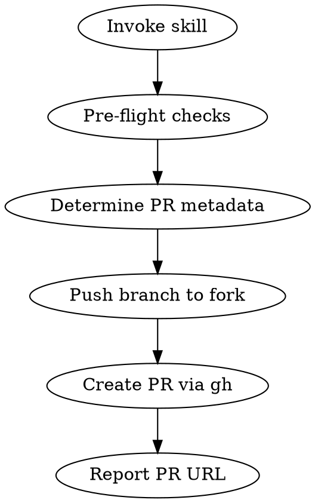

# Submit Pull Request for LoongForge

## Overview

Automates the PR submission workflow for LoongForge: validates changes, pushes to fork, generates a conformant PR title and description, and creates the PR against `baidu-baige/LoongForge:master`.

## Workflow



## Step 1 — Pre-flight Checks

Run these checks before proceeding. STOP and fix if any fail:

1. **Branch is not master** — you must be on a feature branch
2. **Working tree clean** — no uncommitted changes (`git status`)
3. **Commits exist ahead of base** — `git log origin/master..HEAD` shows work
4. **Pre-commit passes** — `pre-commit run --all-files` (if installed)
5. **Remote `origin` points to your fork** — verify with `git remote -v`

## Step 2 — Determine PR Metadata

### Title Format (CI-enforced)

```
[<modules>] <type>: <description>
```

Or for breaking changes:
```
[BREAKING][<modules>] <type>: <description>
```

**Valid modules:** `llm, vlm, vla, diffusion, train, data, ops, ckpt, peft, docker, xpu, ci, docs, tests, scripts, release`

**Valid types:** `feat, fix, refactor, perf, docs, test, chore, ci`

### How to Derive Title

1. Look at `git diff origin/master..HEAD --stat` to identify which areas changed
2. Map changed paths to modules:
   - `loongforge/models/foundation/` → `llm`
   - `loongforge/models/encoder/`, `loongforge/models/omni_models/` → `vlm`
   - `loongforge/train/` → `train`
   - `loongforge/data/` → `data`
   - `tools/convert_checkpoint/` → `ckpt`
   - `loongforge/models/peft/` → `peft`
   - `ops/` → `ops`
   - `configs/` → relevant model type (`llm`/`vlm`)
   - `examples_xpu/` → `xpu`
   - `docker/` → `docker`
   - `docs/` → `docs`
   - `tests/` → `tests`
   - `.github/workflows/` → `ci`
   - `examples/`, `scripts/` → `scripts`
   - `loongforge/models/custom/` → check model type (`diffusion`/`vla`)
3. Determine type from commit messages and nature of changes
4. Write a concise description (imperative mood, lowercase start)

**Examples:**
- `[llm, ckpt] feat: support Qwen3-Next checkpoint conversion`
- `[data, vlm] fix: skip overlong Kimi VLM samples`
- `[docs] docs: fix diffusion docs structure and align ZH/EN toctree`
- `[train] perf: optimize gradient accumulation for MoE models`

### Description Template

Generate a PR body covering:

```markdown
## Summary
<1-3 bullet points explaining WHAT changed and WHY>

## Changes
<Bulleted list of specific modifications, grouped by area>

## Test Plan
<How the changes were verified — tests run, manual checks, etc.>
```

If adding a new model, also include:
```markdown
## Model Info
- **Model family:** <family name>
- **Model sizes:** <supported sizes>
- **Training phases:** pretrain / sft
```

## Step 3 — Human Review

Before pushing or creating anything, present the full PR draft to the user for approval:

1. **Display the PR title and description** in a clear, formatted block
2. **Ask whether to add Co-Authored-By** — offer options:
   - No co-author
   - Add `Co-Authored-By: Claude <noreply@anthropic.com>`
   - Custom co-author (user provides name and email)
3. **Wait for explicit confirmation** before proceeding to Step 4

If the user requests changes, revise and re-present. Do NOT proceed until approved.

## Step 4 — Push and Create PR

Only after user approval in Step 3:

```bash
# Push to fork (origin = your GitHub fork)
git push -u origin <branch-name>

# Create PR targeting upstream via --repo flag
gh pr create \
  --repo baidu-baige/LoongForge \
  --base master \
  --title "<formatted title>" \
  --body "<generated body>"
```

If co-author was requested, append the `Co-Authored-By` trailer to the last commit before pushing:
```bash
git commit --amend -m "$(git log -1 --format=%B)

Co-Authored-By: Name <email>"
```

`--repo baidu-baige/LoongForge` tells `gh` to create the PR against upstream regardless of local remote config. No need to set up an `upstream` remote.

## Step 5 — Post-Creation

After PR is created:
1. Report the PR URL to the user
2. Mention if any CI checks are expected to run (PR Title, License Header, Secret Scan, Build)
3. If the PR touches new `.py/.sh/.cu/.cpp/.h` files, remind about SPDX headers

## Quick Reference

| Module | Paths |
|--------|-------|
| llm | `loongforge/models/foundation/`, `configs/models/<llm>/` |
| vlm | `loongforge/models/encoder/`, `loongforge/models/omni_models/` |
| vla | `loongforge/models/custom/` (VLA models) |
| diffusion | `loongforge/models/custom/` (diffusion models) |
| train | `loongforge/train/` |
| data | `loongforge/data/` |
| ops | `ops/` |
| ckpt | `tools/convert_checkpoint/` |
| peft | `loongforge/models/peft/` |
| docker | `docker/` |
| xpu | `examples_xpu/` |
| ci | `.github/workflows/` |
| docs | `docs/` |
| tests | `tests/` |
| scripts | `examples/`, `scripts/`, `build.sh` |
| release | `pyproject.toml`, version bumps |

## Common Mistakes

| Mistake | Fix |
|---------|-----|
| Title doesn't match regex | Must be `[modules] type: desc` — check module/type spelling |
| Pushing to upstream instead of fork | Always use `git push origin` |
| PR against wrong base branch | LoongForge PRs target `master` (handled by `--repo` + `--base`) |
| New files missing SPDX header | Run `pre-commit run spdx-check --files <path>` |
| Forgot to rebase on latest master | `git pull --rebase origin master` before pushing |
| Submodule pointer changed accidentally | `git checkout upstream/master -- third_party/Loong-Megatron` to reset |
